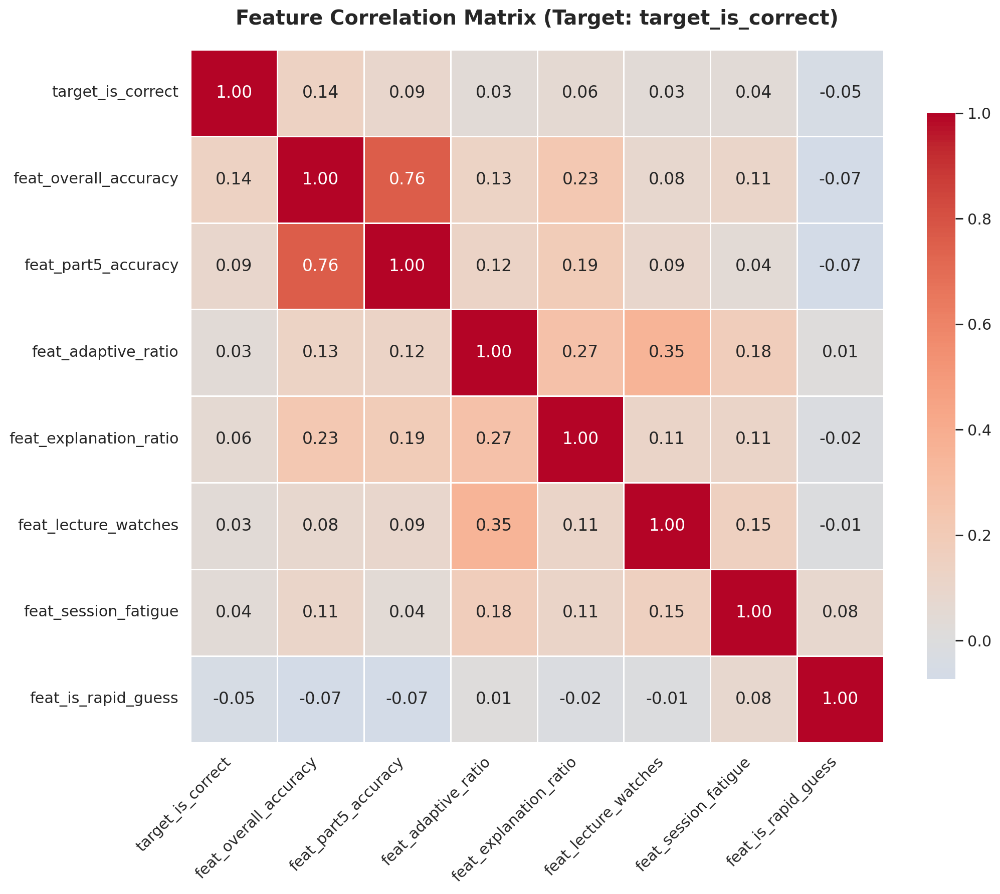
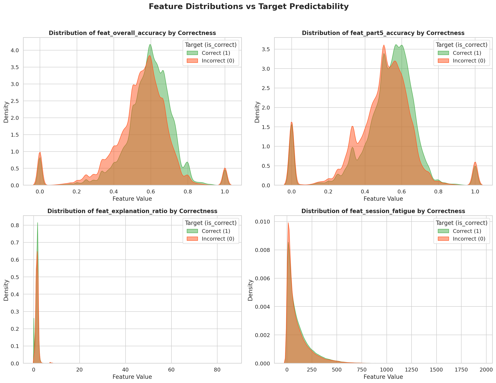

# EdNet-KT4: Feature Engineering Methodology & Summary Report

> **Project**: CS313 — Data Mining and Applications
> **Phase**: Feature Engineering
> **Dataset**: EdNet-KT4
> **Output File**: `kt4_features.parquet`
> **Data Access**: [Download kt4_features.parquet from Google Drive](https://drive.google.com/file/d/1IMV2un2YF26twHfXARzsrgdutUYjle5x/view?usp=sharing)

---

## 1. Overview & Objectives

The primary objective of this phase is to transform raw, preprocessed interaction logs into a robust set of predictive features. For the Knowledge Tracing task, our model must predict the `is_correct` probability of a student's future response at time $t$. 

To achieve this, we extracted 4 distinct feature groups mapping directly to the 5 Key Insights discovered during the EDA phase. All computations were executed out-of-core using **DuckDB** to ensure optimal memory management.

---

## 2. Methodology: Preventing Data Leakage

In sequential and temporal data mining, **Data Leakage** (peeking at the future to predict the present) is a critical pitfall. 

To strictly prevent this, all historical and cumulative features were engineered using SQL Window Functions with a rigorously bounded frame:
`ROWS BETWEEN UNBOUNDED PRECEDING AND 1 PRECEDING`

This ensures that when calculating a student's overall accuracy or total attempts for the $t^{th}$ interaction, the system aggregates data from interaction $1$ up to $t-1$, completely excluding the label of interaction $t$.

---

## 3. Feature Dictionary & EDA Alignment

We condensed the dataset into highly informative features, dynamically computed along each student's temporal axis.

### Identifier Variables
* **`user_id` & `timestamp`**: Keys for sorting and merging.
* **`item_id` & `part`**: The specific question the student is attempting, essential for capturing question difficulty.

### Target Variable
* **`target_is_correct`**: The binary label (1 or 0) for the current `respond` action. Extracted directly from `is_correct` after filtering out non-response actions.

### Group 1: Historical Mastery (Foundation)
* **`feat_total_attempts`**: Cumulative sum of all `respond` actions up to $t-1$. Gives weight and confidence to the accuracy metrics.
* **`feat_overall_accuracy`**: Cumulative correct answers divided by `feat_total_attempts`. Represents the student's global proficiency.

### Group 2: Local & Skill Mastery
* **`feat_part5_accuracy`**: The student's historical accuracy calculated *exclusively* on Part 5 questions. Directly addresses Insight #4 (Part 5 is the hardest).

### Group 3: Pedagogical Strategy
* **`feat_adaptive_ratio`**: The proportion of attempts originating from `adaptive_offer` source. High ratio indicates a structured learning path.
* **`feat_explanation_ratio`**: Total `read_explanation` actions divided by total attempts. Acts as a proxy for student diligence.
* **`feat_lecture_watches`**: Total count of `lecture` items consumed. 

### Group 4: Behavioral & Temporal Dynamics
* **`feat_is_rapid_guess`** (Boolean): Flags a response as an educated guess or spam if `time_since_prev` is less than 3,200 ms.
* **`feat_session_fatigue`**: Computed using a temporal rolling window (`RANGE BETWEEN 3600000 PRECEDING AND 1 PRECEDING`). Counts the absolute number of interactions within the last 60 minutes to capture cognitive overload.

---

## 4. Output Summary

| Metric | Value |
| :--- | :--- |
| **Output File** | `kt4_features.parquet` |
| **Data Link** | [🔗 Google Drive Download](https://drive.google.com/file/d/1IMV2un2YF26twHfXARzsrgdutUYjle5x/view?usp=sharing) |
| **Format** | Apache Parquet (Snappy Compression) |
| **Final Row Count** | 23,308,702 (Filtered for `respond` actions only) |

---

## 5. Feature Evaluation & Visualization

To validate the predictive power of our engineered features before feeding them into machine learning algorithms, we conducted correlation and distribution analyses on a 1-million-row sample.

### 5.1. Correlation Matrix

**Key Insights:**
1. **Predictive Power:** `feat_overall_accuracy` has the highest positive correlation (0.14) with the target, confirming that historical mastery is the strongest baseline predictor.
2. **The Guessing Penalty:** `feat_is_rapid_guess` shows a negative correlation (-0.05). Actions completed in under 3.2 seconds are statistically more likely to be incorrect.
3. **Multicollinearity Warning:** There is a high correlation (0.76) between `feat_overall_accuracy` and `feat_part5_accuracy`. This indicates that while both are useful, tree-based algorithms (like Random Forest or LightGBM) will be better suited for this dataset than linear models, as they inherently handle multicollinearity well.

### 5.2. Feature Distributions vs. Target

**Key Insights:**
* **Distribution Divergence:** In the `feat_overall_accuracy` and `feat_part5_accuracy` subplots, the density curve for "Correct (1)" (Green) shifts visibly to the right compared to "Incorrect (0)" (Orange). This visual divergence proves that our engineered features successfully capture the variance needed for tree-based nodes to find optimal split points.