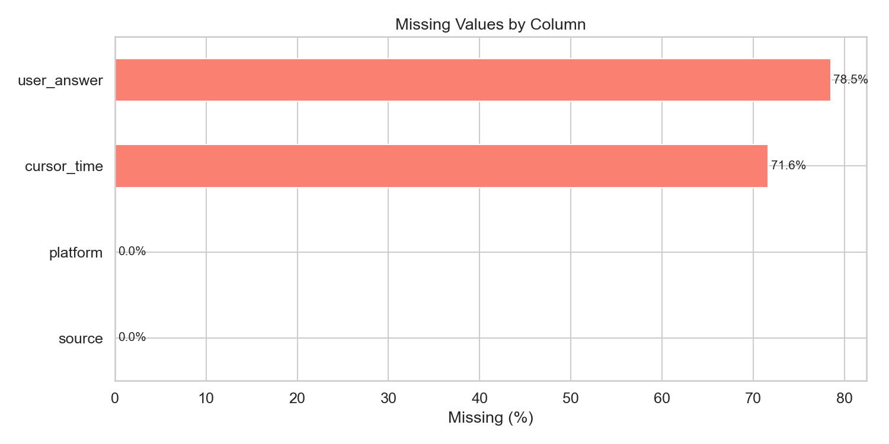

# EdNet-KT4: Dataset Overview & Structural Analysis

## 1. Dataset at a Glance

| Property | Value |
|---|---|
| **Total rows** | 131,441,538 |
| **Total users** | 297,915 |
| **Columns** | 8 |
| **Raw CSV size** | 6.4 GB (297,915 files) |
| **Parquet size** | 1.3 GB (single file, snappy) |
| **Source platform** | Santa (Riiid) — AI tutoring for TOEIC |
| **Collection period** | Aug 2018 – Dec 2019 (461 days) |

## 2. Schema

| Column | Type | Unique Values | Description |
|---|---|---|---|
| `timestamp` | int64 | 127,329,659 | Unix timestamp in ms (shifted for privacy) |
| `action_type` | category | 13 | Type of user action |
| `item_id` | string | 29,642 | ID of question/bundle/lecture/etc. |
| `cursor_time` | float64 | 386,167 | Media playback position in ms |
| `source` | category | 8 | Where in the app the action occurred |
| `user_answer` | category | 4 | Answer choice (a/b/c/d) |
| `platform` | category | 2 | mobile or web |
| `user_id` | int32 | 297,915 | Unique student identifier |

## 3. Missing Values

| Column | Missing Count | Missing % | Explanation |
|---|---|---|---|
| `cursor_time` | 94,155,592 | 71.63% | **Structural** — only present for media actions (play/pause audio/video). 100% present when applicable. |
| `user_answer` | 103,200,432 | 78.51% | **Structural** — only present for respond/erase actions. 100% present when applicable. |
| `source` | 28,312 | 0.02% | **Structural** — null only for payment/coupon/refund actions (no learning context). |
| `platform` | 28,312 | 0.02% | Co-occurs with source nulls — same payment/coupon actions. |
| `timestamp` | 0 | 0% | — |
| `action_type` | 0 | 0% | — |
| `item_id` | 0 | 0% | — |
| `user_id` | 0 | 0% | — |

**Key insight**: All missing values in this dataset are **structurally missing** — they are absent because the column is not applicable to that action type, not because of data collection errors. No imputation is needed.

## 4. Contents Metadata Summary

| File | Rows | Columns | Missing Values |
|---|---|---|---|
| `questions.csv` | 13,169 | 7 (`question_id`, `bundle_id`, `explanation_id`, `correct_answer`, `part`, `tags`, `deployed_at`) | None |
| `lectures.csv` | 1,021 | 5 (`lecture_id`, `part`, `tags`, `video_length`, `deployed_at`) | None (but -1 used as sentinel for unknown) |
| `payments.csv` | 190 | 4 (`payment_item_id`, `type`, `duaration`, `number_of_questions`) | None (note: `duaration` is a typo in the original data) |
| `coupons.csv` | 91 | 3 (`coupon_id`, `coupon_type`, `duration`) | None |

## 5. User-Level Summary

| Statistic | Value |
|---|---|
| Total unique users | 297,915 |
| Mean interactions/user | 441.2 |
| Median interactions/user | **31.0** |
| Std dev | 2,320.9 |
| Min | 2 |
| Max | 203,338 |
| Q1 (25th percentile) | 22 |
| Q3 (75th percentile) | 95 |

**Key insight**: The distribution is **extremely right-skewed** — the median user has only 31 interactions while the mean is 441. A small fraction of power users contribute disproportionately to the dataset. This has major implications for sampling strategies and model training (cold-start users vs. power users).

## 6. Numeric Column Statistics

### Timestamp
- Range: 1,535,338,844,464 – 1,575,234,934,502 (Unix ms)
- Corresponds to: 2018-08-27 to 2019-12-01
- Note: Timestamps are shifted from real values for security (relative patterns still valid)

### Cursor Time (media actions only)
- Count: 37,285,946 non-null values
- Mean: 21,506 ms (~21.5s)
- Median: 9,739 ms (~9.7s)
- Max: 11,633,133 ms (~3.2 hours) — likely an outlier/error
- 75th percentile: 18,363 ms (~18.4s)
