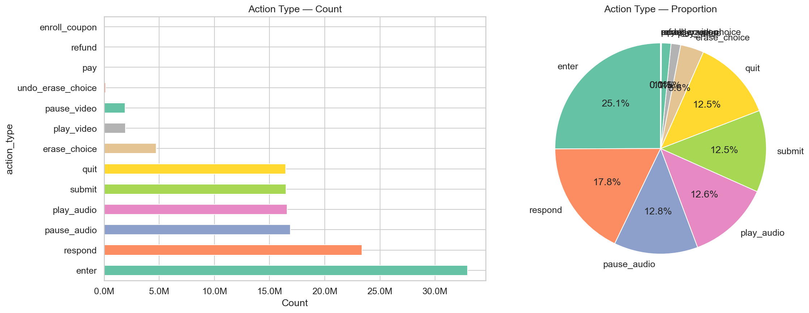
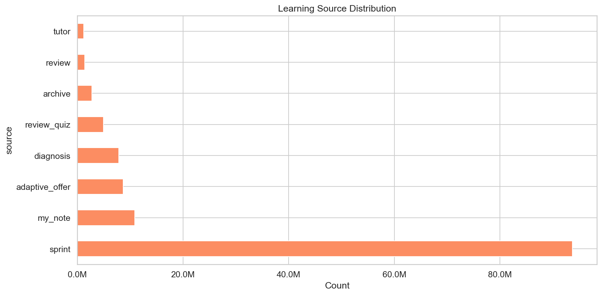
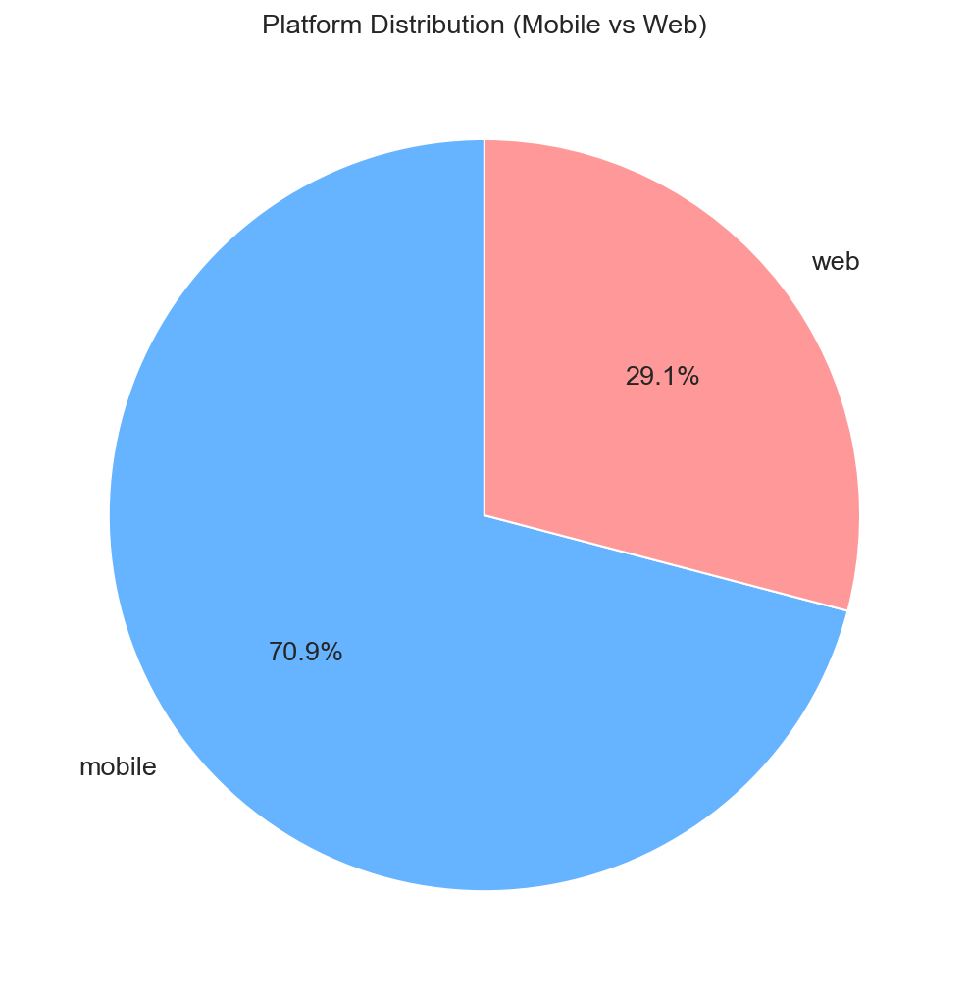
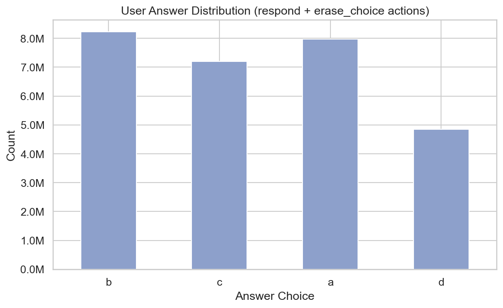
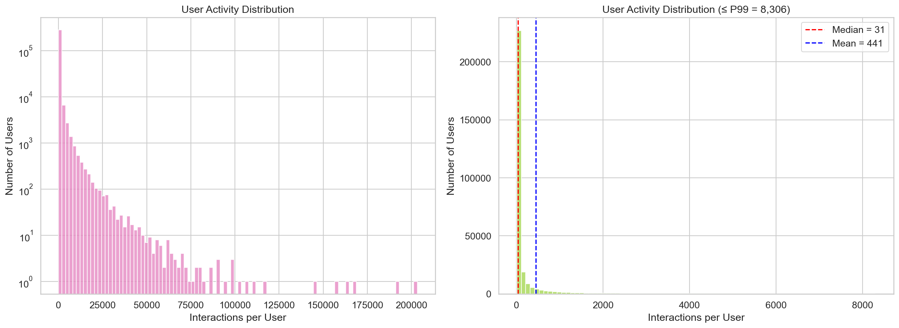
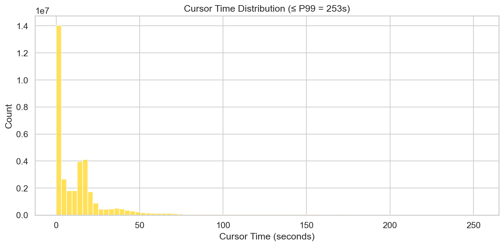
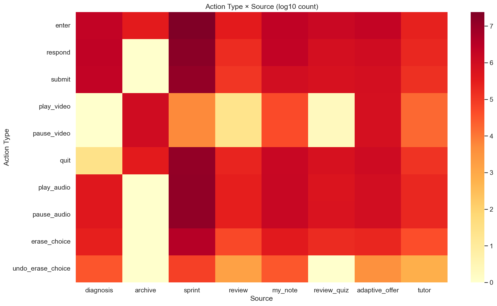
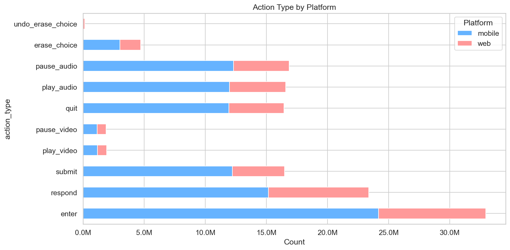

# EdNet-KT4: Distribution Analysis

## 1. Action Type Distribution

| Action Type | Count | Percentage | Category |
|---|---|---|---|
| `enter` | 32,943,087 | 25.06% | Navigation |
| `respond` | 23,384,480 | 17.79% | Question-solving |
| `pause_audio` | 16,879,046 | 12.84% | Media |
| `play_audio` | 16,580,464 | 12.61% | Media |
| `submit` | 16,488,061 | 12.54% | Question-solving |
| `quit` | 16,455,026 | 12.52% | Navigation |
| `erase_choice` | 4,714,534 | 3.59% | Question-solving |
| `play_video` | 1,928,356 | 1.47% | Media |
| `pause_video` | 1,898,080 | 1.44% | Media |
| `undo_erase_choice` | 142,092 | 0.11% | Question-solving |
| `pay` | 26,583 | 0.02% | Transaction |
| `refund` | 1,126 | <0.01% | Transaction |
| `enroll_coupon` | 603 | <0.01% | Transaction |

**Insights**:
- **Audio dominates over video**: play/pause audio accounts for ~25% of all actions vs. ~3% for video. This reflects TOEIC's listening-heavy format.
- **`erase_choice`** (3.59%) shows that answer elimination is a common test-taking strategy, while `undo_erase_choice` (0.11%) is rare — students usually commit to their eliminations.
- **Transaction actions** (pay/refund/coupon) are negligible in volume (<0.03%) but carry engagement/monetization signals.

## 2. Source Distribution

| Source | Count | Percentage | Description |
|---|---|---|---|
| `sprint` | 93,699,620 | 71.29% | Student-chosen part practice |
| `my_note` | 10,874,843 | 8.27% | Review of past explanations |
| `adaptive_offer` | 8,684,878 | 6.61% | System-recommended based on weak areas |
| `diagnosis` | 7,823,171 | 5.95% | Initial diagnostic assessment |
| `review_quiz` | 4,947,945 | 3.76% | Review quizzes from recommendations |
| `archive` | 2,756,068 | 2.10% | Browsing all available lectures |
| `review` | 1,427,814 | 1.09% | Re-doing previously solved questions |
| `tutor` | 1,198,887 | 0.91% | System-chosen questions from all parts |

**Insights**:
- **Sprint mode dominates** (71%) — students overwhelmingly prefer self-directed, part-specific practice over system recommendations.
- The relatively low usage of `adaptive_offer` (6.6%) and `tutor` (0.9%) suggests students don't rely heavily on the AI recommendation system, preferring to choose their own study path.
- **`my_note`** being the 2nd most common source (8.3%) indicates students actively review explanations — a positive learning behavior signal.

## 3. Platform Distribution

| Platform | Count | Percentage |
|---|---|---|
| mobile | 93,181,238 | 70.89% |
| web | 38,231,988 | 29.09% |
| NaN | 28,312 | 0.02% |

**Insight**: A ~71/29 mobile/web split reflects the mobile-first nature of the Santa app in Korea.

## 4. User Answer Distribution

| Answer | Count | Percentage (of responses) |
|---|---|---|
| b | 8,232,269 | 29.2% |
| a | 7,972,379 | 28.3% |
| c | 7,192,663 | 25.5% |
| d | 4,843,795 | 17.2% |

**Insights**:
- **Choice `d` is significantly underrepresented** (17%) compared to a/b/c (~25-29%). This could reflect:
  - TOEIC Part 2 questions only have 3 choices (a/b/c) — no `d` option.
  - A position bias where students are less likely to select the last option.
- Comparing to the correct answer distribution (a: 26.6%, b: 27.5%, c: 25.9%, d: 20.0%), students slightly over-pick `a` and `b` relative to their share of correct answers.

## 5. User Activity Distribution

| Percentile | Interactions |
|---|---|
| P1 | 3 |
| P5 | 9 |
| P10 | 18 |
| P25 | 22 |
| P50 (median) | **31** |
| P75 | 95 |
| P90 | 654 |
| P95 | 1,845 |
| P99 | 8,306 |

**Insights**:
- The distribution is **extremely long-tailed**: 50% of users have 31 or fewer interactions, while the top 1% have 8,300+.
- The gap between median (31) and mean (441) highlights how a small number of power users skew the averages.
- For downstream modeling, **cold-start users** (P25 = 22 interactions) will be challenging — there's very little behavioral data to learn from.
- Consider filtering to users with >= 50 or >= 100 interactions for pattern mining tasks.

## 6. Cursor Time Distribution

- **28.37%** of all rows have a non-null `cursor_time` (media actions only)
- Median: 9,739 ms (~10 seconds) — students typically pause audio/video fairly early
- Mean: 21,506 ms (~21.5 seconds) — pulled up by long-listening sessions
- Max: 11,633,133 ms (~3.2 hours) — clearly an outlier

## 7. Action Type x Source Heatmap

**Top combinations** (all dominated by sprint):
1. `(enter, sprint)` — 24.1M
2. `(respond, sprint)` — 16.6M
3. `(pause_audio, sprint)` — 12.8M

**Insight**: Sprint mode generates the vast majority of every action type. The `archive` source is primarily associated with video actions (play/pause video), which makes sense — it's the lecture browsing mode.

## 8. Action Type x Platform

| Finding | Detail |
|---|---|
| `undo_erase_choice` is **web-only** | 142,092 on web, **0 on mobile** — this feature was not implemented in the mobile UI |
| pay/refund/coupon have no platform | These 28,312 actions have null platform values |
| Mobile/web ratio is consistent | ~71/29 split holds across nearly all action types |
