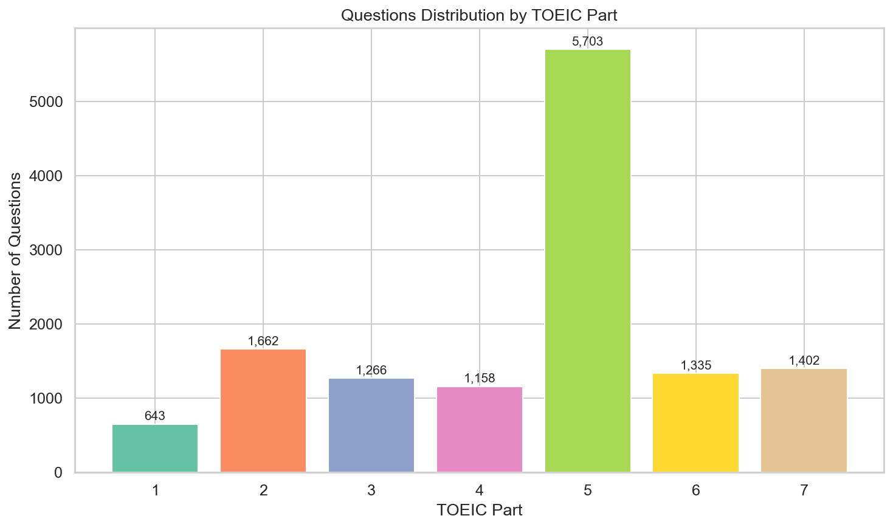
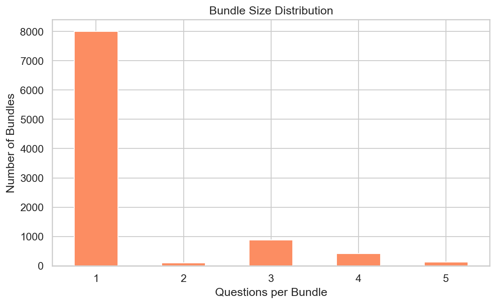
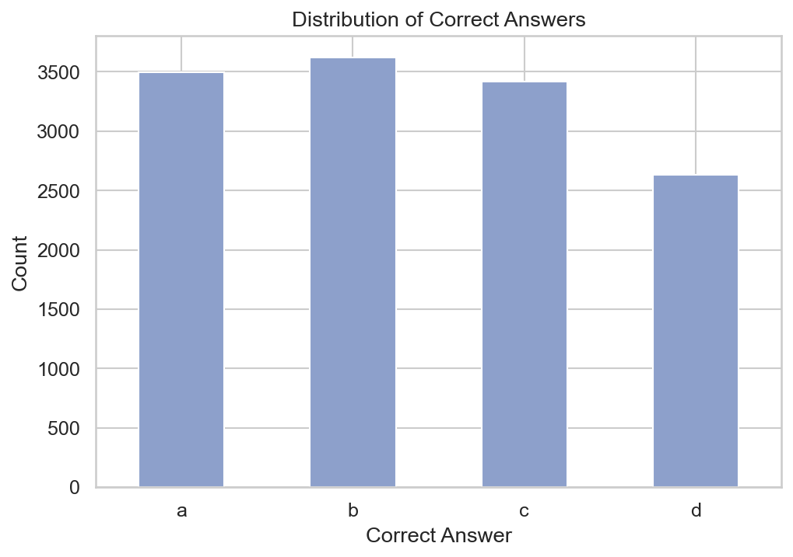
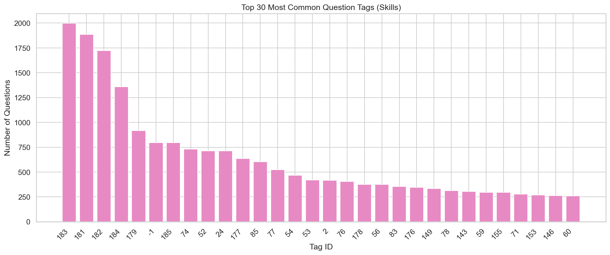
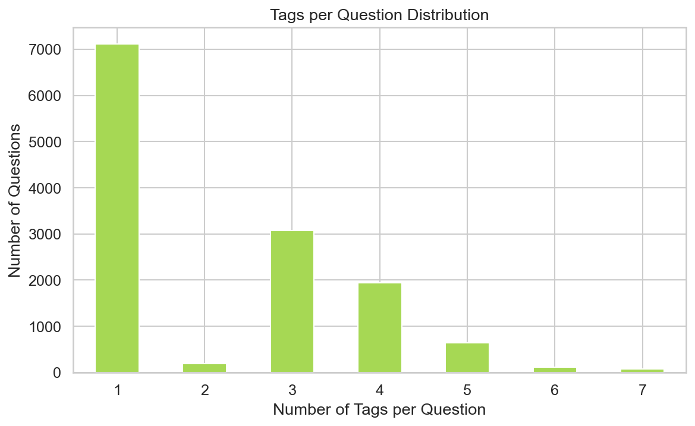
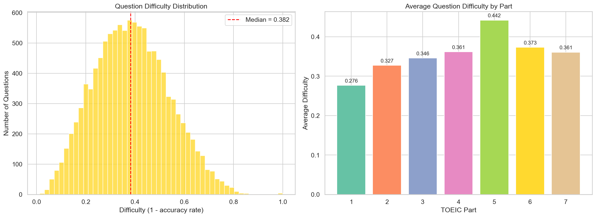
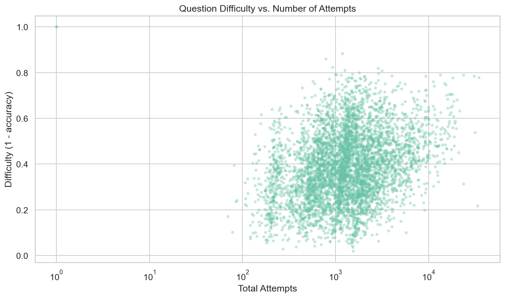
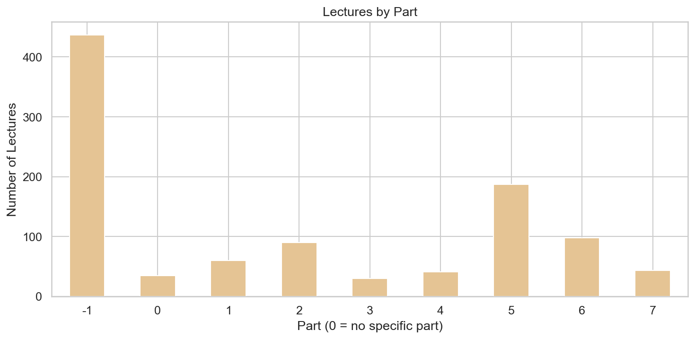
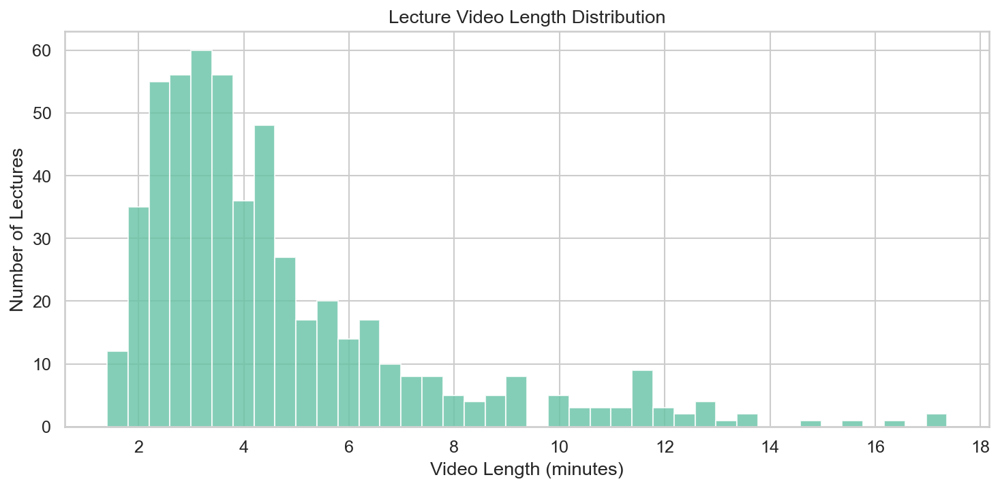

# EdNet-KT4: Question & Content Metadata Analysis

## 1. Questions per TOEIC Part

| Part | Section Name | Questions | Share |
|---|---|---|---|
| 1 | Photo Descriptions | 643 | 4.9% |
| 2 | Question-Response | 1,662 | 12.6% |
| 3 | Short Conversations | 1,266 | 9.6% |
| 4 | Short Talks | 1,158 | 8.8% |
| 5 | Incomplete Sentences | **5,703** | **43.3%** |
| 6 | Text Completion | 1,335 | 10.1% |
| 7 | Reading Comprehension | 1,402 | 10.6% |

**Insights**:
- **Part 5 dominates** with 43% of all questions — nearly half the question bank is grammar/vocabulary fill-in-the-blank. This heavy imbalance means models trained on this data will be disproportionately exposed to Part 5 patterns.
- **Parts 3 and 4** (listening comprehension with conversations/talks) have fewer questions, likely because each listening passage is reused across a bundle of 3-5 questions.
- For balanced analysis, stratification by part is essential.

## 2. Bundle Size Distribution

| Questions per Bundle | Bundles | Notes |
|---|---|---|
| 1 | 8,006 | Standalone questions (Parts 1, 2, 5) |
| 2 | 95 | Rare |
| 3 | 885 | Conversation/talk bundles (Parts 3, 4, 6) |
| 4 | 422 | Reading passages (Part 7) |
| 5 | 126 | Extended reading passages (Part 7) |

**Total bundles: 9,534**

**Insight**: The majority of bundles contain a single question (standalone format), but multi-question bundles are important for Parts 3, 4, 6, and 7 where questions share a common passage or audio.

## 3. Correct Answer Distribution

| Answer | Count | Share |
|---|---|---|
| a | 3,499 | 26.6% |
| b | 3,624 | **27.5%** |
| c | 3,415 | 25.9% |
| d | 2,631 | **20.0%** |

**Insight**: The correct answer distribution is not perfectly uniform. `d` is correct ~20% of the time — recall that Part 2 questions only have 3 choices (a/b/c), which pulls down the share of `d`. Among 4-choice questions, the distribution would be closer to uniform.

## 4. Tag (Skill) Analysis

### Top 30 Tags

| Rank | Tag ID | Questions | Notes |
|---|---|---|---|
| 1 | 183 | 1,997 | Most common skill |
| 2 | 181 | 1,886 | |
| 3 | 182 | 1,723 | |
| 4 | 184 | 1,360 | |
| 5 | 179 | 918 | |
| 6 | **-1** | **797** | **Untagged questions** |
| 7 | 185 | 796 | |
| 8 | 74 | 731 | |
| 9 | 52 | 713 | |
| 10 | 24 | 712 | |

**Insights**:
- **189 unique tags** across 13,169 questions — a rich skill taxonomy.
- Tags in the 179-185 range dominate, suggesting these represent broad, foundational skills.
- **797 questions have tag `-1`** (untagged) — these lack skill annotations and should be handled carefully in skill-based analyses.

### Tags per Question

| Statistic | Value |
|---|---|
| Mean | 2.20 tags/question |
| Median | 1 |
| Min | 1 |
| Max | 7 |

**Insight**: Most questions are tagged with 1-2 skills. Multi-tag questions (3+) test compound skills, which is relevant for knowledge tracing models that need to handle multi-skill interactions.

## 5. Question Difficulty Estimation

Difficulty is computed as `1 - accuracy_rate` where accuracy is derived by matching student responses in KT4 against `correct_answer` in `questions.csv`.

### Overall Statistics

| Metric | Value |
|---|---|
| Total responses matched | 23,384,480 |
| Overall accuracy | **56.83%** |
| Questions with >= 1 attempt | 11,555 / 13,169 |

### Difficulty Distribution

| Statistic | Value |
|---|---|
| Mean difficulty | 0.387 |
| Std dev | 0.151 |
| Min | 0.013 (easiest) |
| Max | 1.000 (hardest) |
| Q1 | 0.277 |
| Median | 0.382 |
| Q3 | 0.490 |

**Insights**:
- The difficulty distribution is approximately **normal** centered around 0.38 — well-calibrated for a standardized test prep platform.
- There are very few trivially easy questions (difficulty < 0.1) or impossibly hard ones (difficulty > 0.9), suggesting good question quality.
- **1,614 questions** (13,169 - 11,555) have **zero attempts** in the KT4 data — these were likely deployed late or are from underused parts.

### Difficulty by Part

| Part | Avg Difficulty | Interpretation |
|---|---|---|
| Hardest parts | Parts with higher values | More frequently answered incorrectly |
| Easiest parts | Parts with lower values | More frequently answered correctly |

The bar chart in the figure above shows the difficulty breakdown. Compare this against student study patterns to identify where students need the most help vs. where they spend the most time.

### Difficulty vs. Number of Attempts

**Insight**: There is a slight negative relationship — questions with more attempts tend to have lower difficulty. This likely reflects that popular (frequently served) questions tend to be from well-practiced skill areas, not that practice makes those specific questions easier.

## 6. Lectures Metadata

### Lectures per Part

| Part | Lectures |
|---|---|
| -1 (unassigned) | **437** |
| 0 (general) | 35 |
| 1 | 60 |
| 2 | 90 |
| 3 | 30 |
| 4 | 41 |
| 5 | **187** |
| 6 | 98 |
| 7 | 43 |

**Insight**: 437 lectures (43%) have `part = -1` (unassigned), meaning almost half the lecture content lacks part categorization. Part 5 has the most assigned lectures (187), matching its dominance in the question bank.

### Video Length Distribution

| Statistic | Value |
|---|---|
| Lectures with valid length | 541 / 1,021 (53%) |
| Mean length | 4.6 min |
| Median length | 3.8 min |
| Min | 1.4 min |
| Max | 17.4 min |

**Insight**: Lectures are short-form content (median ~4 min), designed for mobile consumption. 480 lectures lack valid video length data (`-1` sentinel value).

## 7. Payments & Coupons

| Category | Count | Details |
|---|---|---|
| Payment items | 190 | 173 pass-type, 3 paygo-type, 14 unknown (-1) |
| Coupons | 91 | 7 coupon types |
| Pass duration range | 1 – 730 days | Mean: 144 days |
