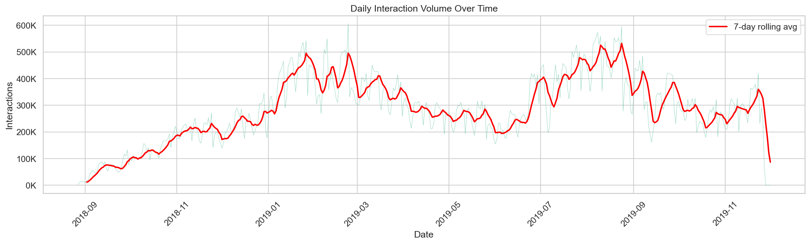
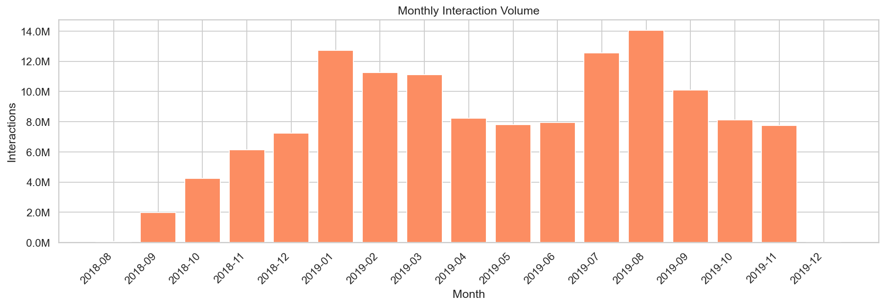
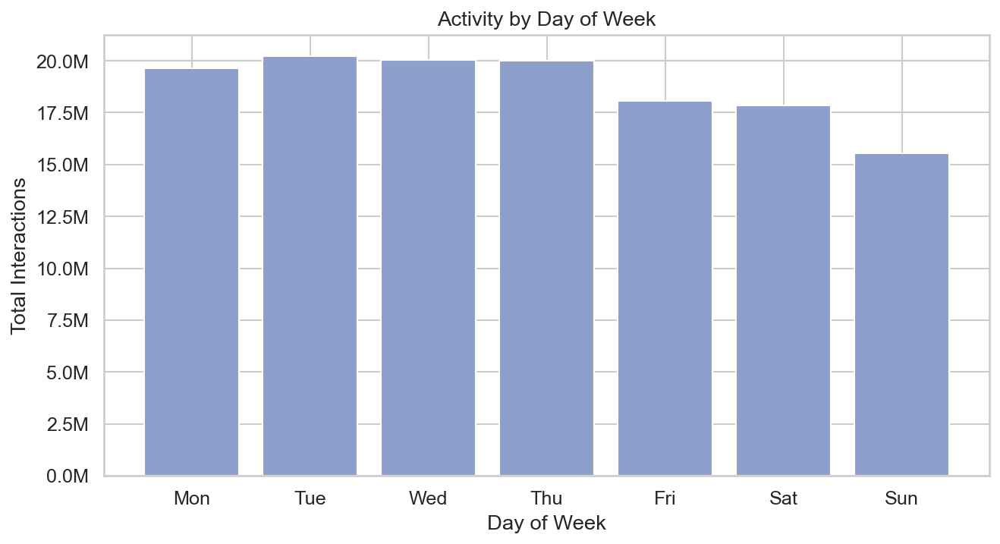
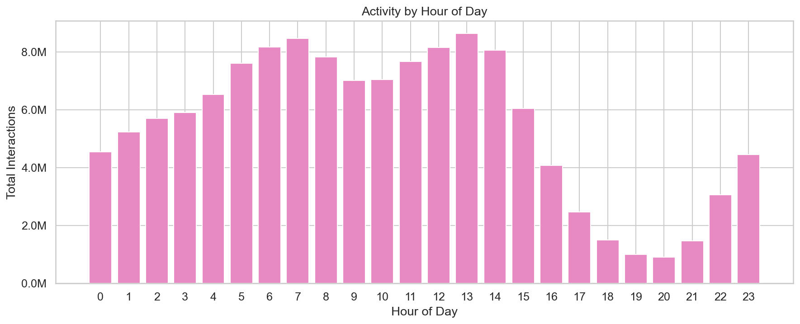
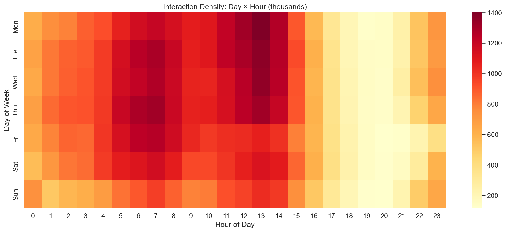
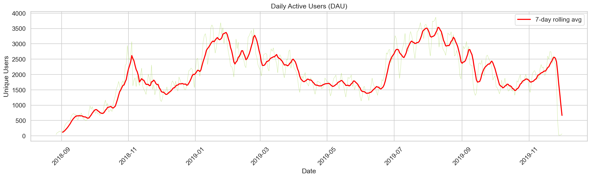
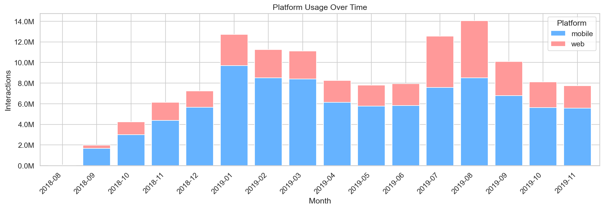
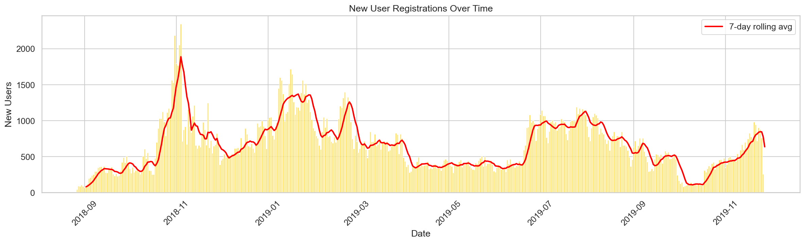

# EdNet-KT4: Temporal Pattern Analysis

> **Note**: EdNet timestamps are shifted from real values for security. Relative patterns (day-of-week, hourly, trends) are still meaningful, but absolute dates should be interpreted with caution.

## 1. Daily Activity Over Time

| Metric | Value |
|---|---|
| Date range | 2018-08-27 to 2019-12-01 |
| Total active days | 462 |
| Avg interactions/day | 284,505 |
| Max interactions/day | 605,921 (2019-02-23) |
| Min interactions/day | 24 (2019-11-28) |

**Insights**:
- The dataset shows a clear **growth trajectory** from late 2018, with the platform ramping up activity through early 2019.
- There are two distinct **peak periods**: **Jan-Feb 2019** and **Jul-Aug 2019**. These likely correspond to TOEIC exam preparation seasons (the TOEIC exam is administered monthly in Korea, with certain months seeing higher registration).
- A sharp drop-off occurs in late Nov 2019, with only 68 interactions in Dec 2019 — this marks the end of the data collection period, not a real decline.

## 2. Monthly Activity

| Month | Interactions | Trend |
|---|---|---|
| 2018-08 | 53,977 | Launch/ramp-up |
| 2018-09 | 1,993,695 | |
| 2018-10 | 4,244,546 | |
| 2018-11 | 6,139,662 | |
| 2018-12 | 7,253,095 | |
| **2019-01** | **12,738,127** | **Peak 1** |
| 2019-02 | 11,265,125 | |
| 2019-03 | 11,125,308 | |
| 2019-04 | 8,246,562 | Decline |
| 2019-05 | 7,815,813 | |
| 2019-06 | 7,959,730 | |
| **2019-07** | **12,569,957** | **Peak 2** |
| **2019-08** | **14,064,488** | **Highest month** |
| 2019-09 | 10,104,529 | |
| 2019-10 | 8,122,872 | |
| 2019-11 | 7,743,984 | |
| 2019-12 | 68 | Data collection ends |

**Insight**: The **bimodal peaks** (Jan and Jul-Aug) align with common TOEIC preparation cycles. The Aug 2019 peak (14M interactions) represents the most active month in the dataset.

## 3. Day-of-Week Patterns

| Day | Interactions | Share |
|---|---|---|
| Mon | 19,653,236 | 14.95% |
| Tue | **20,240,748** | **15.40%** |
| Wed | 20,044,253 | 15.25% |
| Thu | 20,022,999 | 15.23% |
| Fri | 18,062,192 | 13.74% |
| Sat | 17,862,503 | 13.59% |
| **Sun** | **15,555,607** | **11.83%** |

**Insights**:
- **Weekdays are more active** than weekends, with Tuesday being the peak day.
- **Sunday is the quietest** day (11.8%), about 23% less active than Tuesday.
- There's a gradual decline from mid-week toward the weekend — students study more consistently on workdays, potentially during commute time or work breaks (given the mobile-heavy usage).

## 4. Hourly Patterns

| Metric | Value |
|---|---|
| Peak hour | **13:00** (8,639,731 interactions) |
| Quietest hour | **20:00** (909,986 interactions) |

**Insights**:
- Since timestamps are shifted, the absolute hours don't correspond to real clock times. However, the **relative pattern** reveals a single-peak daily cycle.
- The peak-to-trough ratio is ~9.5x, indicating strong daily rhythmicity in study behavior.
- There are no secondary evening peaks, suggesting students primarily study during one concentrated daily window.

## 5. Day x Hour Heatmap

**Insights**:
- The heatmap reveals that the daily activity pattern is **consistent across all days of the week** — the peak hours don't shift between weekdays and weekends.
- Sunday shows uniformly lower activity across all hours, not just during specific times.
- The hotspot (brightest cells) appears on weekday afternoons (shifted time), representing the highest-density study periods.

## 6. Daily Active Users (DAU)

| Metric | Value |
|---|---|
| Average DAU | 2,013 |
| Max DAU | 3,865 (2019-08-08) |
| Min DAU | 23 (2019-11-28) |

**Insights**:
- DAU follows the same pattern as interaction volume, confirming that activity peaks are driven by more users joining, not just existing users doing more.
- Peak DAU of ~3,900 out of 297,915 total users means at most **1.3% of all users** are active on any given day — typical for freemium educational apps with high churn.
- The 7-day rolling average smooths out daily fluctuations and reveals the macro trend more clearly.

## 7. Platform Usage Over Time

**Insights**:
- The **mobile/web ratio remains relatively stable** over time at roughly 70/30.
- Web usage saw a slight increase in mid-2019 (Jul-Aug), possibly driven by longer study sessions during exam prep periods (web may be preferred for extended study).
- No major platform migration trend is visible — both platforms grew and contracted together.

## 8. New User Registrations Over Time

**Insights**:
- New user acquisition mirrors the overall activity pattern — peaks in Jan 2019 and Jul-Aug 2019.
- The daily new user count is quite volatile, suggesting the platform relied on periodic marketing campaigns or event-driven sign-ups rather than steady organic growth.
- The 7-day rolling average helps reveal the underlying acquisition trend beneath daily noise.
