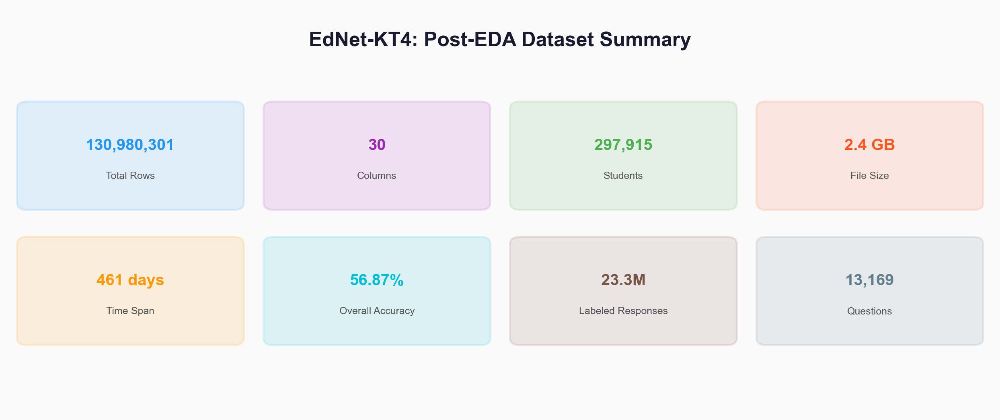
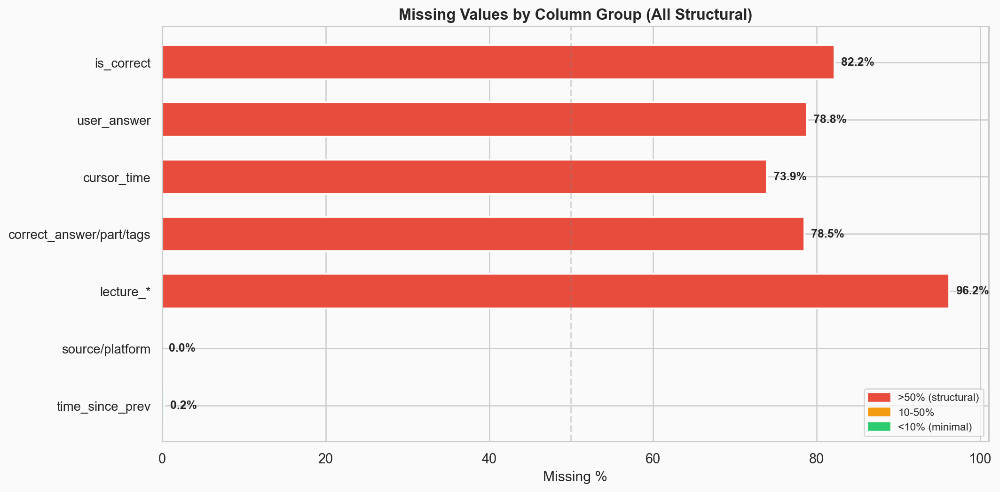
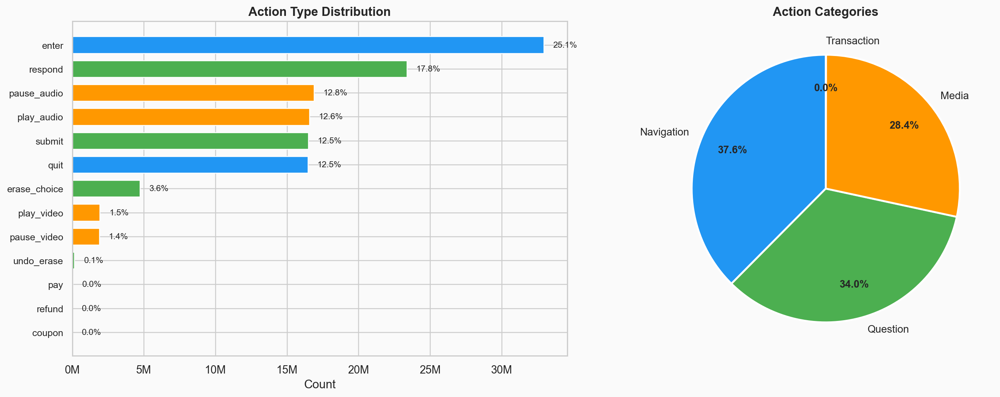
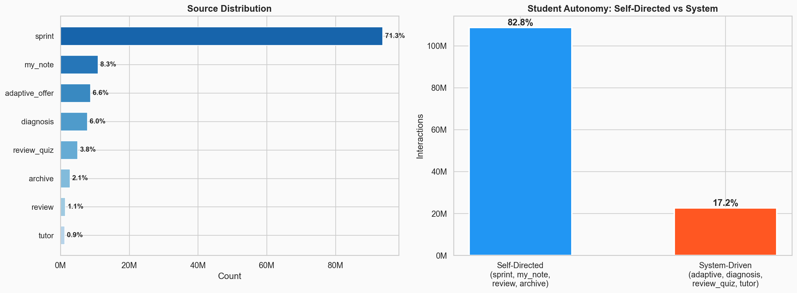
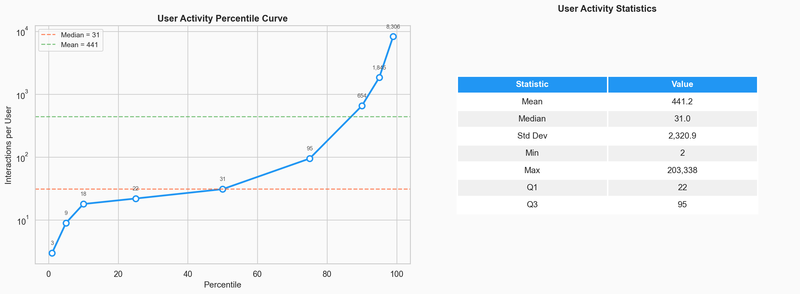
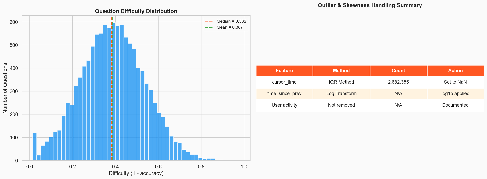
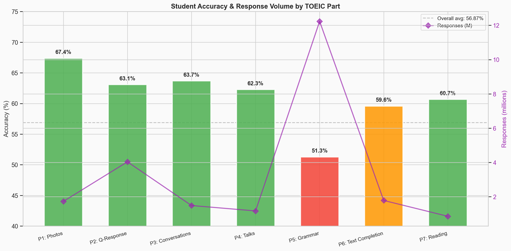
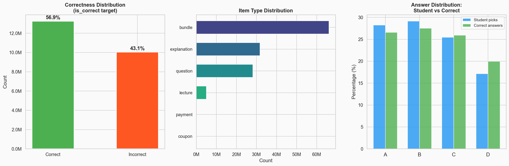
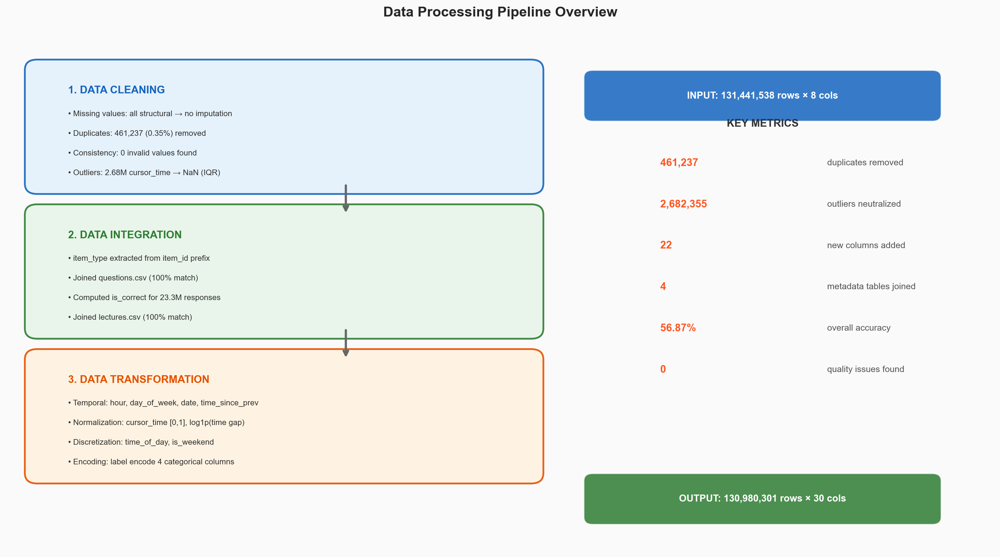

# EdNet-KT4: Post-EDA Statistical Summary Report

> **Project**: CS313 — Data Mining and Applications
> **Dataset**: EdNet-KT4 (131M educational interactions, 298K students)
> **Source Platform**: Santa (Riiid) — AI tutoring for TOEIC exam preparation

---

## 1. Dataset Overview



### Final Dataset Identification

| Property | Value |
|---|---|
| **File** | `processed/kt4_preprocessed.parquet` |
| **Format** | Apache Parquet (snappy compression) |
| **Produced by** | `preprocessing/preprocess.py` |
| **Input** | `processed/kt4_interactions.parquet` (131,441,538 rows × 8 cols) |
| **Final rows** | **130,980,301** (461,237 duplicates removed) |
| **Final columns** | **30** (8 original + 22 derived/integrated) |
| **File size** | 2.4 GB |
| **Collection period** | Aug 2018 – Dec 2019 (461 days) |
| **Unique students** | 297,915 |

### Complete Feature Schema (30 Columns)

| # | Column | Data Type | Source | Description |
|---|---|---|---|---|
| 1 | `timestamp` | int64 | Original | Unix timestamp in ms (shifted for privacy) |
| 2 | `action_type` | category | Original | Type of user action (13 values) |
| 3 | `item_id` | string | Original | ID of question/bundle/lecture/etc. |
| 4 | `cursor_time` | float64 | Original | Media playback position (ms), outliers removed |
| 5 | `source` | category | Original | App source of the action (8 values) |
| 6 | `user_answer` | category | Original | Answer choice (a/b/c/d) |
| 7 | `platform` | category | Original | mobile or web |
| 8 | `user_id` | int32 | Original | Unique student identifier |
| 9 | `item_type` | string | Derived (2a) | Extracted from `item_id` prefix |
| 10 | `bundle_id` | string | Joined (2b) | From `questions.csv` |
| 11 | `correct_answer` | string | Joined (2b) | From `questions.csv` |
| 12 | `part` | float64 | Joined (2b) | TOEIC part (1-7) |
| 13 | `tags` | string | Joined (2b) | Skill tags (semicolon-separated) |
| 14 | `is_correct` | float64 | Computed (2c) | 1.0 if correct, 0.0 if incorrect, NaN otherwise |
| 15 | `lecture_part` | float64 | Joined (2d) | From `lectures.csv` |
| 16 | `lecture_tags` | float64 | Joined (2d) | From `lectures.csv` |
| 17 | `lecture_video_length` | float64 | Joined (2d) | From `lectures.csv` |
| 18 | `hour` | int8 | Derived (3a) | Hour of day (0-23) |
| 19 | `day_of_week` | int8 | Derived (3a) | Day of week (0=Mon, 6=Sun) |
| 20 | `date` | string | Derived (3a) | Calendar date |
| 21 | `time_since_prev` | float64 | Derived (3a) | Time gap (ms) from previous action per user |
| 22 | `action_seq` | int64 | Derived (3a) | 0-indexed position in user's history |
| 23 | `cursor_time_normalized` | float64 | Transformed (3b) | Min-max normalized to [0, 1] |
| 24 | `log_time_since_prev` | float64 | Transformed (3b) | log1p of `time_since_prev` |
| 25 | `time_of_day` | category | Discretized (3c) | night/morning/afternoon/evening |
| 26 | `is_weekend` | int8 | Discretized (3c) | 0=weekday, 1=weekend |
| 27 | `action_type_encoded` | int64 | Encoded (3d) | Label-encoded action type |
| 28 | `source_encoded` | float64 | Encoded (3d) | Label-encoded source |
| 29 | `platform_encoded` | float64 | Encoded (3d) | Label-encoded platform |
| 30 | `item_type_encoded` | float64 | Encoded (3d) | Label-encoded item type |

### Target Variable

`is_correct` (float64) — binary correctness indicator for `respond` actions matched to known questions. Populated for **23,308,702 rows** (56.87% correct, 43.13% incorrect). NaN for all non-response rows.

---

## 2. Data Quality



### Missing Values (Post-Preprocessing)

| Column | Missing Count | Missing % | Reason |
|---|---|---|---|
| `cursor_time` | ~96,837,947 | ~73.9% | Structural (non-media) + outliers set to NaN |
| `user_answer` | ~103,200,432 | ~78.8% | Structural — only for respond/erase actions |
| `source` / `platform` | 28,312 | 0.02% | Structural — payment/coupon/refund actions |
| `correct_answer` / `part` / `tags` | ~102,837,342 | ~78.5% | Only for question-type rows |
| `is_correct` | ~107,671,599 | ~82.2% | Only for respond + matched questions |
| `lecture_part` / `tags` / `video_length` | ~125,971,203 | ~96.2% | Only for lecture-type rows |
| `time_since_prev` | 297,915 | 0.23% | First action per user (no predecessor) |

> **All missing values are structurally expected.** No imputation was applied.

### Duplicates & Consistency

| Check | Result |
|---|---|
| Exact duplicates removed | **461,237** (0.35%) |
| Invalid `user_answer` values | **0** |
| Invalid `platform` values | **0** |
| Non-positive timestamps | **0** |
| Non-monotonic user sequences | **0** (10K sample) |
| Unmapped `item_type` rows | 722 (`item_id = "-1"`) |

---

## 3. Descriptive Statistics

### Categorical Features





#### Action Type (13 unique values)

| Value | Count | % | Category |
|---|---|---|---|
| enter | 32,943,087 | 25.06% | Navigation |
| respond | 23,384,480 | 17.79% | Question |
| pause_audio | 16,879,046 | 12.84% | Media |
| play_audio | 16,580,464 | 12.61% | Media |
| submit | 16,488,061 | 12.54% | Question |
| quit | 16,455,026 | 12.52% | Navigation |
| erase_choice | 4,714,534 | 3.59% | Question |
| play_video | 1,928,356 | 1.47% | Media |
| pause_video | 1,898,080 | 1.44% | Media |
| undo_erase_choice | 142,092 | 0.11% | Question |
| pay | 26,583 | 0.02% | Transaction |
| refund | 1,126 | <0.01% | Transaction |
| enroll_coupon | 603 | <0.01% | Transaction |

#### Source (8 unique values)

| Value | Count | % |
|---|---|---|
| sprint | 93,699,620 | 71.29% |
| my_note | 10,874,843 | 8.27% |
| adaptive_offer | 8,684,878 | 6.61% |
| diagnosis | 7,823,171 | 5.95% |
| review_quiz | 4,947,945 | 3.76% |
| archive | 2,756,068 | 2.10% |
| review | 1,427,814 | 1.09% |
| tutor | 1,198,887 | 0.91% |

#### Platform: mobile 70.89% / web 29.09% / NaN 0.02%

#### Item Type

| Value | Count | % |
|---|---|---|
| bundle | 66,092,768 | 50.46% |
| explanation | 31,706,442 | 24.21% |
| question | 28,142,959 | 21.49% |
| lecture | 5,009,098 | 3.82% |
| payment | 27,709 | 0.02% |
| coupon | 603 | <0.01% |

### Numerical Features



#### User Activity (interactions per user)

| Statistic | Value |
|---|---|
| Mean | 441.2 |
| Median | **31.0** |
| Std Dev | 2,320.9 |
| Min | 2 |
| Max | 203,338 |
| P25 | 22 |
| P75 | 95 |
| P90 | 654 |
| P95 | 1,845 |
| P99 | 8,306 |

#### cursor_time (after outlier removal, media actions only)

| Statistic | Value |
|---|---|
| Clean range | 0 – 44,125 ms |
| Median | ~9,739 ms (~10s) |
| Q1 | 0 ms |
| Q3 | 17,650 ms |

#### time_since_prev (per-user inter-action gap)

| Statistic | Value |
|---|---|
| Mean | 2,536,439 ms (~42 min) |
| Median | 3,216 ms (~3.2 sec) |
| Q1 | 429 ms |
| Q3 | 11,814 ms (~12s) |
| Max | 38,535,629,790 ms (~446 days) |

---

## 4. Distribution & Outliers



### Skewness Summary

| Feature | Skewness Pattern | Evidence |
|---|---|---|
| **User activity** | Extreme right skew | Median=31, Mean=441, Max=203,338 |
| **time_since_prev** | Extreme right skew | Median=3.2s, Mean=42min, Max=446 days |
| **cursor_time** | Right skew | Median=9.7s, Mean=21.5s (pre-cleanup) |
| **Question difficulty** | ~Normal | Mean=0.387, Median=0.382, Std=0.151 |

### Outlier Treatment

| Feature | Method | Affected | Action |
|---|---|---|---|
| `cursor_time` | IQR (Q3+1.5×IQR = 44,125ms) | 2,682,355 values | Set to NaN (rows kept) |
| `time_since_prev` | Log transform | All values | log1p applied (no removal) |
| User activity | Not treated | N/A | Extreme skew documented |

---

## 5. Feature Relationships





### Correctness Analysis (Target Variable)

| Metric | Value |
|---|---|
| Labeled responses | 23,308,702 |
| Overall accuracy | **56.87%** |
| Correct | 13,254,939 (56.87%) |
| Incorrect | 10,053,763 (43.13%) |

### Accuracy by TOEIC Part

| Part | Name | Accuracy | Difficulty | Responses |
|---|---|---|---|---|
| 1 | Photo Descriptions | **67.4%** | 0.326 | 1,730,438 |
| 2 | Question-Response | 63.1% | 0.369 | 4,037,705 |
| 3 | Short Conversations | 63.7% | 0.364 | 1,489,468 |
| 4 | Short Talks | 62.3% | 0.377 | 1,173,289 |
| 5 | Incomplete Sentences | **51.3%** | **0.487** | **12,231,178** |
| 6 | Text Completion | 59.6% | 0.404 | 1,784,682 |
| 7 | Reading Comprehension | 60.7% | 0.393 | 861,942 |

### Key Cross-Feature Findings

| Relationship | Finding |
|---|---|
| action × source | Sprint dominates all types (71%); archive → video |
| action × platform | `undo_erase_choice` is web-only (0 on mobile) |
| difficulty × attempts | Slight negative correlation |
| day_of_week × activity | Weekdays > weekends; Tue peak, Sun lowest |
| Monthly trends | Bimodal peaks: Jan 2019, Jul-Aug 2019 |

---

## 6. Key Insights

### 1. Extreme User Activity Skew
The median user has only **31 interactions** vs. mean **441** (14× gap). A small fraction of power users contribute disproportionately. Cold-start users (P25=22) have minimal behavioral data.

### 2. All Missing Values Are Structural
Every missing value exists because the column doesn't apply to that action type. Zero data quality issues were found across 130M+ rows — no imputation needed.

### 3. Sprint Mode Dominance (71%)
Students overwhelmingly prefer self-directed practice over AI recommendations (adaptive_offer only 6.6%). This has major implications for recommendation system design.

### 4. Part 5 Is Hardest and Most Practiced
Part 5 (grammar) has 43% of questions, 52% of responses, but the lowest accuracy (51.3%). The platform effectively drives remediation behavior.

### 5. Rich Temporal Patterns
Bimodal TOEIC-season peaks (Jan, Jul-Aug), consistent mobile dominance (71%), weekday preference with Tuesday peaks. Average DAU is 2,013 (0.68% of users).

---

## 7. Data Processing Summary



### Pipeline

```
Raw 297K CSVs (6.4 GB)
  │  eda/01_convert_to_parquet.py
  ▼
kt4_interactions.parquet (131,441,538 rows × 8 cols, 1.3 GB)
  │  eda/02-05_eda_*.py (analysis only)
  │  preprocessing/preprocess.py
  ▼
kt4_preprocessed.parquet (130,980,301 rows × 30 cols, 2.4 GB)
```

### Transformation Impact

| Step | Operation | Impact on Statistics |
|---|---|---|
| 1a. Missing values | No imputation (structural) | Preserves authentic patterns |
| 1b. Deduplication | 461,237 rows removed | 131.4M → 131.0M rows |
| 1c. Consistency | Validation only | Zero corrections needed |
| 1d. Outliers | cursor_time IQR → NaN | Max reduced from 3.2hrs to 44s |
| 2a. Item type | Prefix extraction | 6 types + 722 unmapped |
| 2b. Questions join | questions.csv merge | 28.1M rows enriched (100%) |
| 2c. Correctness | user_answer == correct | 23.3M labeled rows created |
| 2d. Lectures join | lectures.csv merge | 5.0M rows enriched (100%) |
| 3a. Temporal | Timestamp decomposition | 5 new temporal features |
| 3b. Normalization | Min-max + log1p | Model-ready numeric features |
| 3c. Discretization | Hour→TOD, DOW→weekend | Categorical temporal features |
| 3d. Encoding | Label encoding × 4 | ML-ready integers |

### Design Decisions

1. **Lossless**: Original columns preserved alongside all derived columns
2. **Structural NaN**: No imputation — filling would introduce misleading signals
3. **Outlier → NaN**: cursor_time outliers nullified, rows kept intact
4. **Log transform**: time_since_prev skew handled via log1p, preserving extreme-but-real patterns

---

## Appendix: Existing EDA Visualizations

The following plots from the EDA pipeline provide additional context:

| Plot | Path |
|---|---|
| Missing Values | `../plots/01_missing_values.png` |
| Action Type Distribution | `../plots/02_action_type_distribution.png` |
| Source Distribution | `../plots/02_source_distribution.png` |
| Platform Distribution | `../plots/02_platform_distribution.png` |
| User Answer Distribution | `../plots/02_user_answer_distribution.png` |
| User Activity Distribution | `../plots/02_user_activity_distribution.png` |
| Cursor Time Distribution | `../plots/02_cursor_time_distribution.png` |
| Action × Source Heatmap | `../plots/02_action_source_heatmap.png` |
| Action × Platform | `../plots/02_action_platform_stacked.png` |
| Questions per Part | `../plots/03_questions_per_part.png` |
| Question Difficulty | `../plots/03_question_difficulty.png` |
| Difficulty vs Attempts | `../plots/03_difficulty_vs_attempts.png` |
| Top Tags | `../plots/03_top_tags.png` |
| Daily Activity | `../plots/04_daily_activity.png` |
| Monthly Activity | `../plots/04_monthly_activity.png` |
| Day of Week | `../plots/04_day_of_week.png` |
| Hourly Pattern | `../plots/04_hourly_pattern.png` |
| Day × Hour Heatmap | `../plots/04_day_hour_heatmap.png` |
| Daily Active Users | `../plots/04_daily_active_users.png` |
| Platform Over Time | `../plots/04_platform_over_time.png` |
| New Users Over Time | `../plots/04_new_users_over_time.png` |
| Cursor Time Outliers | `../../preprocessing/plots/05_cursor_time_outliers.png` |
| Preprocessing Summary | `../../preprocessing/plots/05_preprocessing_summary.png` |