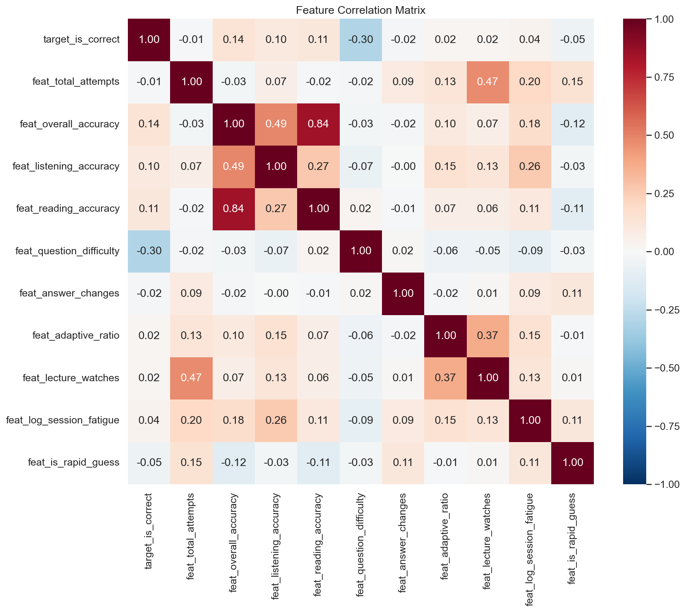
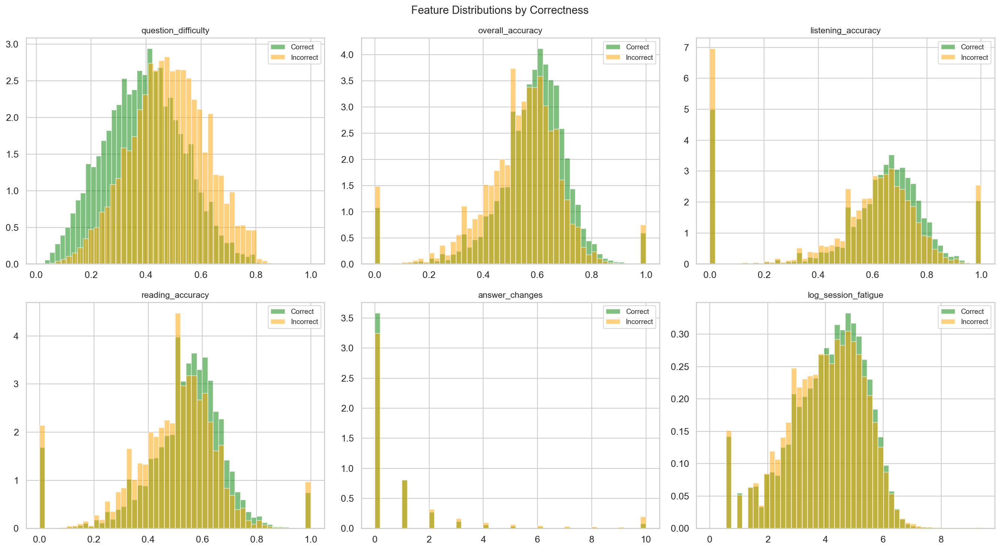

# EdNet-KT4: Feature Engineering Report

## Overview

This module transforms the preprocessed EdNet-KT4 interaction logs into a feature table for answer correctness prediction. Each row represents a single student response, enriched with 10 engineered features capturing question properties, student mastery, behavioral signals, and engagement patterns.

**Script**: `feature_engineering/generate_features.py`
**Input**: `processed/kt4_preprocessed.parquet` ([Google Drive](https://drive.google.com/file/d/1-y5GXRjb9xs1JMt8L0R_D6eOjzZpfvHI/view?usp=drive_link))
**Output**: `processed/kt4_features.parquet` (23,308,702 rows x 15 columns, ~484 MB) ([Google Drive](https://drive.google.com/file/d/1CGxjrjg97-JZ602ll0tbRm3o2kAaD6H4/view?usp=drive_link))

## Leakage Prevention

All cumulative student features are computed using only data from interactions 1..t-1 when predicting at time t. This prevents the model from "seeing" future information during training.

First-row features for each user are explicitly set to 0 (no prior history available).

---

## Feature Dictionary

### Identifiers & Target

| Column | Description |
|---|---|
| `user_id` | Student identifier |
| `timestamp` | When the response happened (Unix ms) |
| `item_id` | Question ID (e.g., `q5012`) |
| `part` | TOEIC part 1-7 |
| `target_is_correct` | Label — 1 if the student answered correctly, 0 otherwise |

### Features (ranked by absolute correlation with target)

| Feature | Corr | Group | Description |
|---|---|---|---|
| `feat_question_difficulty` | **-0.300** | Question | Historical difficulty of this question, computed as `1 - accuracy_rate` across all students. Property of the question, not the student. |
| `feat_overall_accuracy` | +0.140 | Mastery | Student's cumulative accuracy across all parts, up to t-1. |
| `feat_reading_accuracy` | +0.112 | Mastery | Student's cumulative accuracy on Parts 5-7 (reading section) up to t-1. |
| `feat_listening_accuracy` | +0.097 | Mastery | Student's cumulative accuracy on Parts 1-4 (listening section) up to t-1. |
| `feat_is_rapid_guess` | -0.052 | Behavioral | Binary flag: 1 if the response was faster than P10 of response time (690ms), indicating possible guessing. |
| `feat_log_session_fatigue` | +0.038 | Engagement | Log1p of the count of all actions within a 1-hour rolling window before this response. Proxy for cognitive load. |
| `feat_answer_changes` | -0.023 | Behavioral | Cumulative count of prior respond actions on this same question by this student. Captures re-encounters and answer revision. Unique to KT4. |
| `feat_adaptive_ratio` | +0.022 | Behavioral | Proportion of the student's prior attempts that came from the adaptive recommendation system (source=`adaptive_offer`). |
| `feat_lecture_watches` | +0.017 | Engagement | Cumulative count of lectures consumed by the student before this response. |
| `feat_total_attempts` | -0.010 | Mastery | Cumulative count of the student's respond actions up to t-1. Provides confidence weighting for accuracy features. |

---

## Feature Groups

### 1. Question Properties

**`feat_question_difficulty`** is the single most predictive feature (correlation -0.30). It encodes each question's historical difficulty based on all students' performance. This is an item-level property with no leakage concern — it doesn't depend on the current student's history.

### 2. Student Mastery

Three accuracy features capture the student's knowledge state:
- **Overall accuracy** gives the global picture
- **Listening** (Parts 1-4) and **reading** (Parts 5-7) accuracy capture the core TOEIC skill divide

The listening vs reading split has a mutual correlation of only **0.27**, meaning they capture distinct competencies. This is important because TOEIC's two sections test genuinely different skills (audio comprehension vs grammar/reading).

`feat_total_attempts` provides confidence weighting — an accuracy of 0.5 from 2 attempts is very different from 0.5 from 500 attempts.

### 3. Behavioral Signals

- **Answer changes** capture re-encounters and uncertainty. A value of 0 means this is the student's first attempt at this question; higher values indicate prior attempts or answer revisions.
- **Rapid guessing** (responses under 690ms) flags likely random answers. These have ~9 percentage points lower accuracy.
- **Adaptive ratio** measures how much the student relies on the AI recommendation system vs self-directed study.

### 4. Engagement & Fatigue

- **Session fatigue** (log-transformed) counts all actions in the preceding hour. Higher values indicate extended study sessions where cognitive load may reduce performance.
- **Lecture watches** captures how many lectures the student has consumed up to this point in time.

---

## Validation

### Quality Checks
- Zero null values across all 15 columns
- Zero users with non-zero accuracy at first response (leakage-free)
- All cumulative features use only data from interactions before time *t* (no future leakage)
- `feat_total_attempts` is monotonically increasing per user
- `feat_lecture_watches` is cumulative per user over time (not static lifetime count)
- `feat_answer_changes` is cumulative per (user, question) over time
- `feat_is_rapid_guess` flags ~10% of responses
- Listening vs reading accuracy mutual correlation = 0.27 (low redundancy)
- Row count matches preprocessed respond actions: 23,308,702
