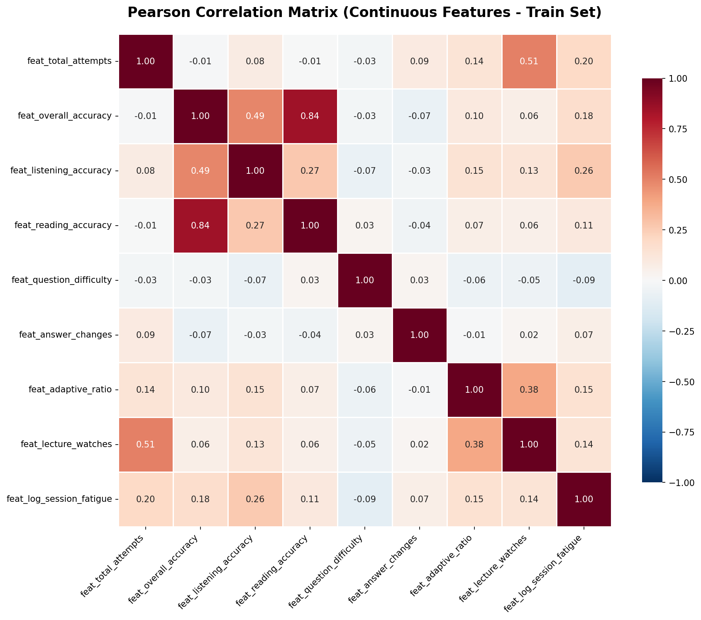
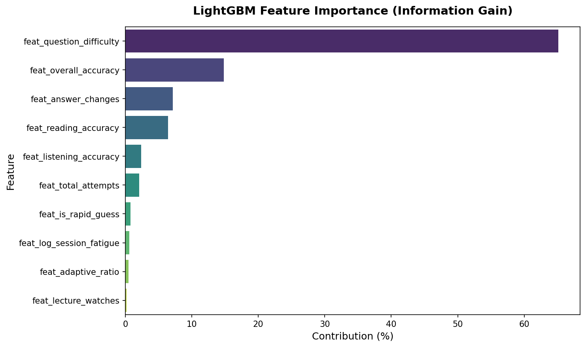

# EdNet-KT4: Feature Selection Report

## Overview

This module evaluates the 10 engineered features generated during the Feature Engineering phase to construct the optimal feature set. The selection process ensures maximum predictive power while eliminating redundant information (multicollinearity) and noisy/sparse features.

**Script**: `feature_selection/feature_selection.py`
**Input**: `processed/kt4_features.parquet` (18.7M Train rows after split)
**Output 1**: `processed/test_users_list.csv` (Holdout user IDs)
**Output 2**: `processed/selected_features.json` ( file containing 7 final features)

---

## 1. Train/Test Split Strategy

To prevent data leakage, a **Group-based split** (`GroupShuffleSplit`) was applied using `user_id`. This guarantees that a student's entire interaction history belongs strictly to either the training set or the testing set.

- **Train Set:** 18,752,725 rows (80%)
- **Test Set:** 4,555,977 rows (20%)
- **Test Users Record:** Extracted to `test_users_list.csv` to ensure consistency across the team's modeling pipelines without duplicating heavy data files.

## 2. Multicollinearity Analysis (Filter Method)

A Pearson correlation matrix was calculated across all continuous features on the training set.

### Primary Alert (Red Flag)

- **`overall_accuracy` & `reading_accuracy` (r = 0.84):** A severe collinearity was detected. As identified in `03_eda_metadata.md`, Part 5 (Reading) accounts for 43.3% of the entire question bank. Consequently, a student's overall accuracy is overwhelmingly dictated by their reading performance.

### Secondary Behavioral Correlations (Moderate)

- **`overall_accuracy` & `listening_accuracy` (r = 0.49):** The moderate correlation here confirms that Listening is a distinct cognitive competency compared to Reading. This solidifies the business logic to treat them as independent features.
- **`feat_total_attempts` & `feat_lecture_watches` (r = 0.51):** Represents the "diligent student" effect. Students who practice more also tend to watch more lectures.
- **`feat_adaptive_ratio` & `feat_lecture_watches` (r = 0.38):** Reflects "guided learning" behavior. Students engaging with lectures also tend to utilize the AI's adaptive recommendations.

## 3. Statistical Power Analysis (Filter Methods)

Features were individually evaluated against the binary target (`target_is_correct`) using **ANOVA F-test** and **Chi-Square**. Due to the massive sample size (N > 18.5M), a strict p-value threshold (p < 0.001) was observed.

| Feature                    | Method     | Score     | Significance |
| -------------------------- | ---------- | --------- | ------------ |
| `feat_question_difficulty` | ANOVA      | 1,840,374 | **Highest**  |
| `feat_overall_accuracy`    | ANOVA      | 376,205   | Very High    |
| `feat_reading_accuracy`    | ANOVA      | 237,138   | High         |
| `feat_listening_accuracy`  | ANOVA      | 178,100   | High         |
| `feat_is_rapid_guess`      | Chi-Square | 43,121    | Medium       |
| `feat_log_session_fatigue` | ANOVA      | 28,986    | Medium       |
| `feat_answer_changes`      | ANOVA      | 15,793    | Medium-Low   |
| `feat_adaptive_ratio`      | ANOVA      | 8,784     | Low          |
| `feat_lecture_watches`     | ANOVA      | 4,909     | Very Low     |
| `feat_total_attempts`      | ANOVA      | 283       | Lowest       |

## 4. Non-Linear Feature Importance (Embedded Method)

A LightGBM classifier was trained to capture non-linear relationships. Importance was measured using **Information Gain**.

- `feat_question_difficulty` completely dominates, contributing **65.16%** of the model's total information gain.
- `feat_answer_changes`, despite scoring poorly in linear ANOVA, ranked 3rd in LightGBM (7.11%), demonstrating strong non-linear interaction with question difficulty (e.g., changing answers on a hard question strongly indicates uncertainty).

## 5. Synthesis & Final Selection

The final feature set bridges the gap between data-driven metrics and educational domain logic. **Tree-based models can aggregate independent components, but they cannot disentangle aggregated metrics.** Therefore, providing granular features is prioritized over aggregated ones.

### Selected Features (7 Features)

| Feature                    | Rationale                                                                       |
| -------------------------- | ------------------------------------------------------------------------------- |
| `feat_question_difficulty` | **Core Driver:** most powerful predictor (65% Gain).                            |
| `feat_reading_accuracy`    | **Domain Selection:** Kept over `overall_accuracy` to maintain explainability.  |
| `feat_listening_accuracy`  | **Domain Selection:** Independent skill dimension (r=0.27 with Reading).        |
| `feat_answer_changes`      | **Behavioral:** Captures non-linear hesitation signals effectively.             |
| `feat_is_rapid_guess`      | **Behavioral:** Robust identifier for random guessing behavior.                 |
| `feat_log_session_fatigue` | **Contextual:** Captures the cognitive load degradation within a study session. |
| `feat_total_attempts`      | **Weighting:** Acts as a confidence scalar for the accuracy features.           |

### Dropped Features (3 Features)

| Feature                 | Drop Rationale                                                                                                                                                                                                          |
| ----------------------- | ----------------------------------------------------------------------------------------------------------------------------------------------------------------------------------------------------------------------- |
| `feat_overall_accuracy` | Dropped to eliminate the severe multicollinearity (r=0.84) with Reading. Providing separate Reading/Listening inputs allows the system to generate actionable, targeted feedback for students.                          |
| `feat_adaptive_ratio`   | **Sparse Data & Low Variance:** Scored poorly (< 0.5% Gain). Root cause traced back to `02_eda_distributions.md`: the `adaptive_offer` source accounts for only 6.61% of data. For >90% of rows, this feature equals 0. |
| `feat_lecture_watches`  | **Low Predictive Power:** Ranked at the absolute bottom in Information Gain (0.15%). Adds dimensionality without improving accuracy.                                                                                    |

---
