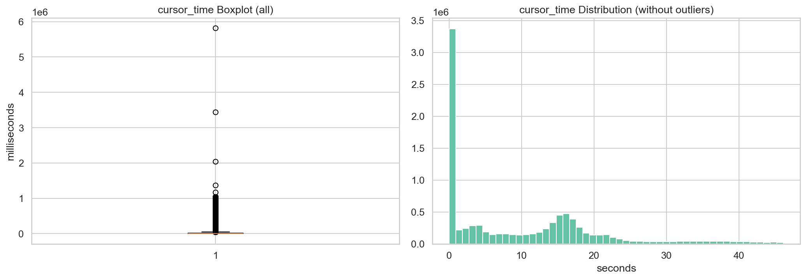
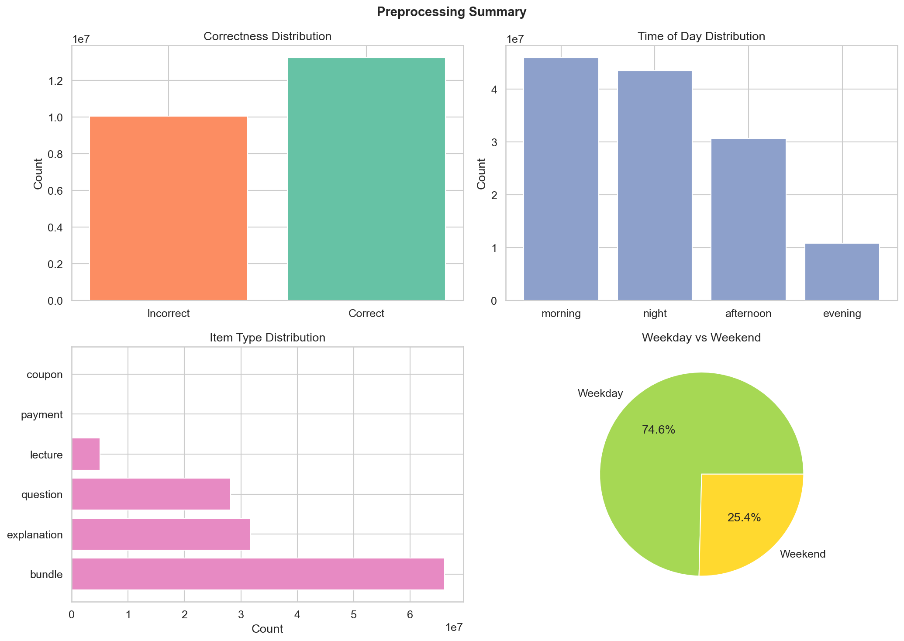

# EdNet-KT4: Preprocessing Pipeline Report

This report documents all preprocessing steps applied to the EdNet-KT4 dataset, aligned with the CS313 Data Mining course curriculum (Data Cleaning, Data Integration, Data Transformation, Data Reduction).

**Input**: `processed/kt4_interactions.parquet` (131,441,538 rows x 8 columns)
**Output**: `processed/kt4_preprocessed.parquet` (130,980,301 rows x 30 columns)

Original columns are preserved alongside derived columns. Outlier cursor_time values are removed (set to NaN) prior to normalization.

---

## Step 1: Data Cleaning (Slides 10-13)

### 1a. Missing Values Analysis

| Column | Missing | % | Verdict |
|---|---|---|---|
| `cursor_time` | 94,155,592 | 71.63% | Structural — only present for media actions. **100% present when applicable.** No imputation needed. |
| `user_answer` | 103,200,432 | 78.51% | Structural — only for respond/erase actions. **100% present when applicable.** No imputation needed. |
| `source` | 28,312 | 0.02% | Structural — only null for pay/refund/coupon actions (no learning context). |
| `platform` | 28,312 | 0.02% | Co-occurs with source nulls (same payment/coupon rows). |

**Decision**: No imputation applied. All missing values are structurally expected and documented. Filling them would introduce misleading information.

### 1b. Duplicate Detection & Removal

| Check | Count | Action |
|---|---|---|
| Exact duplicate rows | **461,237** (0.35%) | **Removed** |
| Key duplicates (user_id + timestamp + action_type + item_id) | 463,729 | Subset of exact duplicates |

**Rows after deduplication: 130,980,301** (removed 461,237 rows)

These duplicates likely arose from client-side retry logic (network issues causing the same event to be logged twice). Since they are exact duplicates, removal is safe and lossless.

### 1c. Consistency Checks

| Check | Result |
|---|---|
| `user_answer` values outside {a, b, c, d} | **0** — all valid |
| `platform` values outside {mobile, web} | **0** — all valid |
| Non-positive timestamps | **0** — all valid |
| Users with non-monotonic timestamps (sampled 10K users) | **0** — all temporally ordered |

**Decision**: No inconsistencies found. The dataset is internally consistent.

### 1d. Outlier Detection (cursor_time)



| Statistic | Value |
|---|---|
| Q1 | 0 ms |
| Q3 | 17,650 ms |
| IQR | 17,650 ms |
| Upper bound | 44,125 ms (~44s) |
| Outliers removed | **2,682,355** values set to NaN |

**Decision**: Outlier cursor_time values above the IQR upper bound (44s) were **removed** (set to NaN). These extreme values (up to 11.6M ms / ~3.2 hours) likely represent sessions left running accidentally and would distort downstream normalization. The rows themselves are preserved — only the unreliable cursor_time values are cleared. This ensures the subsequent min-max normalization produces a meaningful [0, 1] range over the clean data (0–44s).

---

## Step 2: Data Integration (Slides 14-24)

### 2a. Item Type Extraction

Derived `item_type` from the prefix of `item_id`:

| Prefix | Item Type | Row Count |
|---|---|---|
| `b` | bundle | 66,092,768 |
| `e` | explanation | 31,706,442 |
| `q` | question | 28,142,959 |
| `l` | lecture | 5,009,098 |
| `p` | payment | 27,709 |
| `c` | coupon | 603 |
| `-1` | unmapped | **722** |

**Note**: 722 rows have `item_id = "-1"` — these cannot be mapped to any content type.

### 2b. Join with Questions Metadata

Merged `questions.csv` into interaction rows where `item_type == "question"`:

| Metric | Value |
|---|---|
| Question-related rows | 28,142,959 |
| Successfully matched | **28,142,959 (100%)** |
| Columns added | `bundle_id`, `correct_answer`, `part`, `tags` |

### 2c. Correctness Computation

For each `respond` action matched to a question, computed:

```
is_correct = (user_answer == correct_answer)
```

| Metric | Value |
|---|---|
| Respond actions with correctness | 23,308,702 |
| Correct | 13,254,939 (**56.87%**) |
| Incorrect | 10,053,763 (43.13%) |

This `is_correct` column is the foundation for any future correctness prediction or knowledge tracing task.

### 2d. Join with Lectures Metadata

Merged `lectures.csv` into interaction rows where `item_type == "lecture"`:

| Metric | Value |
|---|---|
| Lecture-related rows | 5,009,098 |
| Successfully matched | **5,009,098 (100%)** |
| Columns added | `lecture_part`, `lecture_tags`, `lecture_video_length` |

### 2e. Redundancy Check

| Finding | Decision |
|---|---|
| `bundle_id` is derivable from `item_id` via questions.csv | **Kept** — avoids repeated joins in downstream analysis |
| `explanation_id` == `bundle_id` for all questions | **Not added** — fully redundant |
| `item_type` is derivable from `item_id` prefix | **Kept** — useful derived column for filtering |

---

## Step 3: Data Transformation (Slides 25-28)

### 3a. Attribute Construction

| New Column | Source | Description |
|---|---|---|
| `hour` | `timestamp` | Hour of day (0-23), int8 |
| `day_of_week` | `timestamp` | Day of week (0=Mon, 6=Sun), int8 |
| `date` | `timestamp` | Calendar date (string) |
| `time_since_prev` | `timestamp` | Time gap (ms) since previous action within same user |
| `action_seq` | row position | 0-indexed action sequence number within each user's history |

**`time_since_prev` statistics:**

| Statistic | Value |
|---|---|
| Mean | 2,536,439 ms (~42 min) |
| Median | 3,216 ms (~3.2s) |
| Q1 | 429 ms |
| Q3 | 11,814 ms (~12s) |
| Max | 38,535,629,790 ms (~446 days) |

**Insight**: The median inter-action time of ~3 seconds reflects rapid sequential actions within a session (e.g., enter → respond → submit). The extreme max indicates users who returned after very long absences. The `log_time_since_prev` transform (see below) handles this skew.

### 3b. Normalization (Slide 26-27)

| Column | Method | Details |
|---|---|---|
| `cursor_time_normalized` | **Min-max normalization** | Scaled `cursor_time` to [0, 1] range. Clean range: [0, 44,125] ms (after outlier removal in Step 1d). Median normalized value: 0.15. |
| `log_time_since_prev` | **Log transform** (log1p) | Applied `log(1 + time_since_prev)` to handle the extreme right skew. This makes the distribution more amenable to downstream models. |

### 3c. Discretization (Slide 28)

| Column | Method | Bins |
|---|---|---|
| `time_of_day` | **Binning** by hour | `night` (0-6), `morning` (6-12), `afternoon` (12-18), `evening` (18-24) |
| `is_weekend` | **Binary encoding** | `0` = weekday (Mon-Fri), `1` = weekend (Sat-Sun) |

### 3d. Categorical Label Encoding

Integer encoding for key categorical columns (original string columns preserved):

| Column | Categories | Encoding |
|---|---|---|
| `action_type_encoded` | 13 values | 0: enroll_coupon, 1: enter, 2: erase_choice, 3: pause_audio, 4: pause_video, 5: pay, 6: play_audio, 7: play_video, 8: quit, 9: refund, 10: respond, 11: submit, 12: undo_erase_choice |
| `source_encoded` | 8 values | 0: adaptive_offer, 1: archive, 2: diagnosis, 3: my_note, 4: review, 5: review_quiz, 6: sprint, 7: tutor |
| `platform_encoded` | 2 values | 0: mobile, 1: web |
| `item_type_encoded` | 6 values | 0: bundle, 1: coupon, 2: explanation, 3: lecture, 4: payment, 5: question |

---

## Step 4: Data Reduction (Slide 29)

The full preprocessed dataset is saved without reduction, to preserve flexibility for the team. The following strategies are **documented for downstream use**:

| Strategy | When to Apply | Example |
|---|---|---|
| **User sampling** | Prototype modeling, fast iteration | Random sample of 10K-50K users |
| **Stratified sampling** | Balanced analysis | Sample equal counts across activity levels |
| **Attribute subset selection** | Task-specific modeling | Drop `cursor_time`, payment actions for correctness prediction |
| **Aggregation** | User-level modeling | Compute per-user feature vectors (accuracy, avg time, session count) |
| **Cold-start filtering** | Remove noise from inactive users | Keep only users with >= 50 interactions |
| **PCA** | Dimensionality reduction on engineered features | After creating a wide feature matrix |

---

## Output Summary

### Preprocessing Results



### Final Dataset Schema

| # | Column | Type | Source |
|---|---|---|---|
| 1 | `timestamp` | int64 | Original |
| 2 | `action_type` | category | Original |
| 3 | `item_id` | string | Original |
| 4 | `cursor_time` | float64 | Original |
| 5 | `source` | category | Original |
| 6 | `user_answer` | category | Original |
| 7 | `platform` | category | Original |
| 8 | `user_id` | int32 | Original |
| 9 | `item_type` | string | Step 2a: Extracted from item_id |
| 11 | `bundle_id` | string | Step 2b: From questions.csv |
| 12 | `correct_answer` | string | Step 2b: From questions.csv |
| 13 | `part` | float64 | Step 2b: TOEIC part (1-7) |
| 14 | `tags` | string | Step 2b: Skill tags |
| 15 | `is_correct` | float64 | Step 2c: Computed correctness |
| 16 | `lecture_part` | float64 | Step 2d: From lectures.csv |
| 17 | `lecture_tags` | float64 | Step 2d: From lectures.csv |
| 18 | `lecture_video_length` | float64 | Step 2d: From lectures.csv |
| 19 | `hour` | int8 | Step 3a: From timestamp |
| 20 | `day_of_week` | int8 | Step 3a: From timestamp |
| 21 | `date` | string | Step 3a: From timestamp |
| 22 | `time_since_prev` | float64 | Step 3a: Per-user time gap |
| 23 | `action_seq` | int64 | Step 3a: Per-user action index |
| 24 | `cursor_time_normalized` | float64 | Step 3b: Min-max [0,1] |
| 25 | `log_time_since_prev` | float64 | Step 3b: Log1p transform |
| 26 | `time_of_day` | category | Step 3c: Discretized hour |
| 27 | `is_weekend` | int8 | Step 3c: Binary weekday/weekend |
| 28 | `action_type_encoded` | int64 | Step 3d: Label encoded |
| 29 | `source_encoded` | float64 | Step 3d: Label encoded |
| 30 | `platform_encoded` | float64 | Step 3d: Label encoded |
| 31 | `item_type_encoded` | float64 | Step 3d: Label encoded |

### File Sizes

| File | Size | Description |
|---|---|---|
| `kt4_interactions.parquet` | 1.3 GB | Raw consolidated (from 6.4GB CSV) |
| `kt4_preprocessed.parquet` | 2.4 GB | Cleaned + integrated + transformed |
