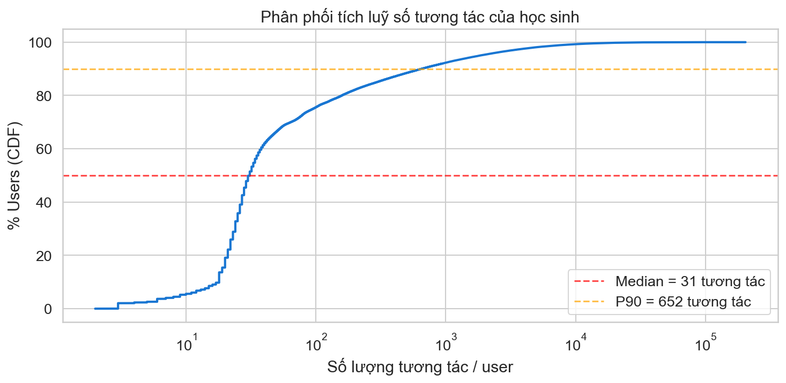
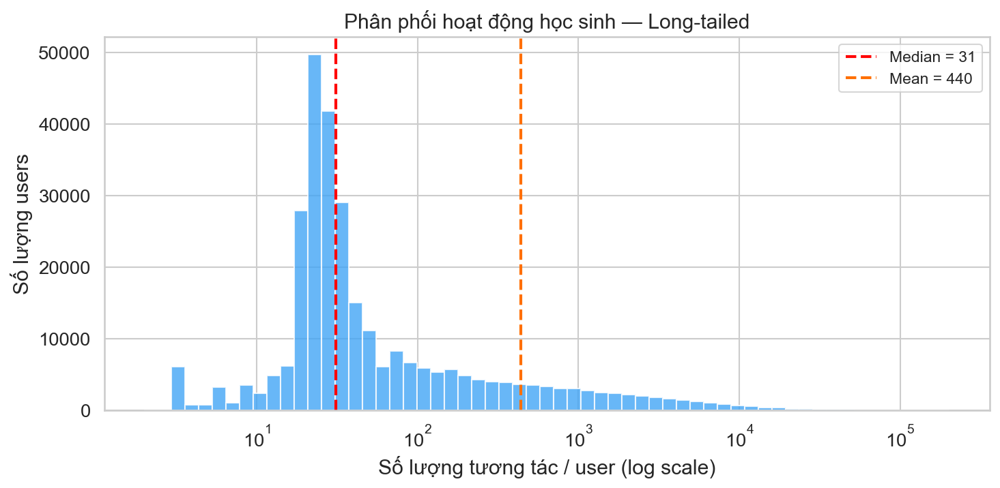
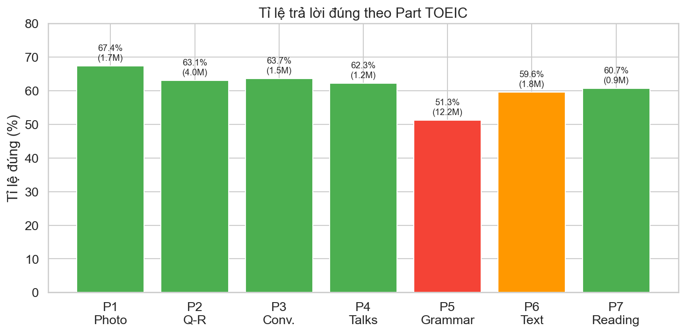
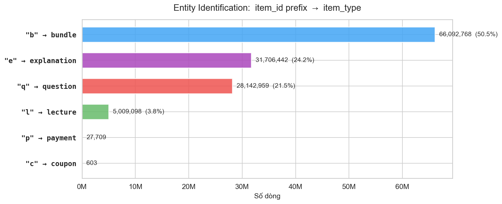
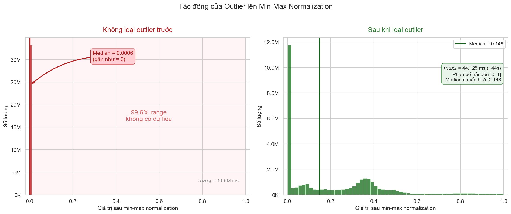
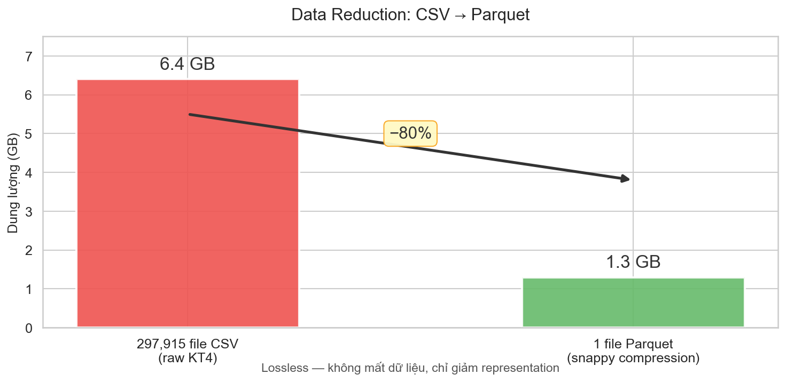

# Nội dung Slides: EDA & Pre-processing

> Tài liệu hướng dẫn nội dung cho các slide EDA (7 slides) và Pre-processing (6 slides) — tổng 13 slides.
> Các slide được đánh số tiếp nối từ slide 10 trong file hiện tại.
> Plots tham chiếu nằm trong `output/eda/plots/` và `output/preprocessing/plots/`.

---

## SLIDE 10 — EDA: Tổng quan & Missing Values

### Nội dung:

**Tổng quan dataset (KT4):**
- 131,441,538 dòng × 8 cột (297,915 file CSV, mỗi file = 1 học sinh)
- 297,915 học sinh | 13 loại hành vi | 8 nguồn học

**Phân tích Missing Values:**
- `cursor_time`: 71.63% null → **structural** (chỉ có cho play/pause audio/video)
- `user_answer`: 78.51% null → **structural** (chỉ có cho respond/erase)
- `source`, `platform`: 0.02% null → chỉ null cho pay/refund/coupon
- Kết luận: **Không cần imputation** — tất cả missing values đều có lý do cấu trúc

> *Liên hệ bài giảng Slide 11:* "A missing value may not imply an error in the data" — đúng với trường hợp của chúng ta, missing là do cột không áp dụng cho loại hành vi đó.

### Plot:

---

## SLIDE 11 — EDA: Phân phối Action Types & Sources

### Nội dung:

**Phân phối 13 loại hành vi (action_type):**
- `enter` (25.1%), `respond` (17.8%), `pause_audio` (12.8%), `play_audio` (12.6%)
- Audio >> Video: phản ánh đặc điểm bài thi TOEIC (Part 1-4 là Listening)
- `erase_choice` (3.6%): chiến lược loại trừ đáp án
- `undo_erase_choice` chỉ tồn tại trên **web** (0 trên mobile) → khác biệt UI giữa 2 nền tảng

**Phân phối nguồn học (source):**
- `sprint` chiếm **71.3%** — học sinh chủ động chọn part để luyện tập
- `adaptive_offer` chỉ 6.6% — ít sử dụng gợi ý từ AI
- `my_note` (8.3%): học sinh tích cực đọc lại giải thích

### Plots:

---

## SLIDE 12 — EDA: Phân phối User Activity & Platform

### Nội dung:

**Phân phối số tương tác / user — Độ lệch cực kỳ lớn (skewness):**

| Thống kê | Giá trị |
|---|---|
| Mean | 441.2 |
| **Median** | **31** |
| Std | 2,320.9 |
| P90 | 654 |
| P99 | 8,306 |
| Max | 203,338 |

> *Liên hệ bài giảng Slide 8-9 (Statistical Descriptions):*
> - Mean ($\bar{x}$) bị kéo bởi outliers → Median phản ánh chính xác hơn (31 vs 441)
> - **IQR** = Q3 - Q1 = 95 - 22 = 73
> - Variance cực lớn ($\sigma^2$) → phân phối long-tailed

**Platform:** 71% Mobile, 29% Web

### Plots:

---

## SLIDE 13 — EDA: Phân phối câu hỏi theo Part TOEIC

### Nội dung:

**Số lượng câu hỏi theo Part:**

| Part | Tên | Số câu | Tỉ lệ |
|---|---|---|---|
| 1 | Photo Descriptions | 643 | 4.9% |
| 2 | Question-Response | 1,662 | 12.6% |
| 3 | Short Conversations | 1,266 | 9.6% |
| 4 | Short Talks | 1,158 | 8.8% |
| **5** | **Incomplete Sentences** | **5,703** | **43.3%** |
| 6 | Text Completion | 1,335 | 10.1% |
| 7 | Reading Comprehension | 1,402 | 10.6% |

- **Part 5 chiếm gần nửa** ngân hàng câu hỏi → mất cân bằng lớn
- Lý do: Part 5 là câu hỏi đơn lẻ (1 câu/bundle), dễ sản xuất hàng loạt
- Part 3, 4 ít hơn vì mỗi bundle cần 1 đoạn audio + 3 câu hỏi

### Plot:

---

## SLIDE 14 — EDA: Phân tích độ khó câu hỏi

### Nội dung:

**Công thức tính độ khó:**

$$\text{difficulty}(q) = 1 - \frac{\sum_{i=1}^{N} \mathbb{1}[\text{correct}_i]}{N}$$

Trong đó $N$ là tổng số lượt trả lời câu hỏi $q$ trên toàn hệ thống.

**Thống kê tổng quan:**
- Tổng số lượt respond: 23,308,702 | Tỉ lệ đúng: **56.87%**
- Độ khó trung bình: 0.387 | Std: 0.151
- Phân phối gần **chuẩn** (well-calibrated cho nền tảng luyện thi)

**Độ khó theo Part:**

| Part | Accuracy | Nhận xét |
|---|---|---|
| Part 5 (Grammar) | **51.3%** | Khó nhất — 12.2M lượt trả lời |
| Part 6 (Text) | 59.6% | |
| Part 7 (Reading) | 60.7% | |
| Part 1 (Photo) | **67.4%** | Dễ nhất |

→ **Listening (P1-4) dễ hơn Reading (P5-7)** — kỹ năng đọc là điểm yếu

### Plots:

---

## SLIDE 15 — EDA: Xu hướng thời gian

### Nội dung:

**Hoạt động theo thời gian (461 ngày, 08/2018 – 12/2019):**
- Hai đỉnh hoạt động: **01/2019** và **07-08/2019** → trùng với mùa thi TOEIC
- TB 284,505 tương tác/ngày | Đỉnh: 605,921 (23/02/2019)

**Theo ngày trong tuần:**
- Ngày thường hoạt động hơn cuối tuần
- **Chủ nhật** thấp nhất (11.8%), **Thứ 3** cao nhất (15.4%)

**DAU (Daily Active Users):**
- TB 2,013 users/ngày — chỉ **0.67%** tổng số users
- Đỉnh: 3,865 users (08/08/2019)

### Plots:

---

## SLIDE 16 — EDA: Heatmap Hoạt động Ngày × Giờ

### Nội dung:

**Mật độ tương tác theo ngày trong tuần và giờ trong ngày:**

- Mẫu hành vi **nhất quán qua tất cả các ngày** — giờ cao điểm không thay đổi giữa ngày thường và cuối tuần
- **Chủ nhật** hoạt động thấp đều ở mọi khung giờ (không chỉ riêng giờ nào)
- Vùng nóng nhất (brightest cells): buổi chiều các ngày trong tuần

> *Lưu ý:* Timestamps trong EdNet đã được dịch chuyển (shifted) vì lý do bảo mật. Các mẫu tương đối (giờ cao/thấp, ngày cao/thấp) vẫn có ý nghĩa, nhưng giờ tuyệt đối không phản ánh giờ thực.

### Plot:

---

## SLIDE 17 — PREPROCESSING: Data Cleaning (1/2)

### Nội dung:

> *Bài giảng Slide 10:* Data Cleaning gồm 3 nhiệm vụ: **Fill in missing values**, **Smooth out noise**, **Correct inconsistencies**.

**1. Fill in Missing Values (Slide 11):**

Bài giảng liệt kê các phương pháp: ignore the tuple, fill manually, fill automatically (mean/median/regression).

Áp dụng: Tất cả missing values trong dataset đều là **structural** — cột không áp dụng cho loại hành vi đó:
- `cursor_time` null 71.63% → chỉ tồn tại cho play/pause audio/video
- `user_answer` null 78.51% → chỉ tồn tại cho respond/erase
- `source`, `platform` null 0.02% → chỉ null cho pay/refund/coupon

→ **Không cần fill in** — đây đúng theo nguyên tắc bài giảng: *"A missing value may not imply an error in the data"* (Slide 11)

**2. Correct Inconsistencies (Slide 13):**
- `user_answer` ∈ {a, b, c, d}: ✓ (0 vi phạm)
- `platform` ∈ {mobile, web}: ✓ (0 vi phạm)
- Timestamps dương và tăng đơn điệu theo user: ✓ (0 vi phạm trên toàn bộ 297,915 users)
- Phát hiện **461,237 tuple trùng lặp hoàn toàn** (0.35%) → đã xoá, còn **130,980,301 dòng**

---

## SLIDE 18 — PREPROCESSING: Data Cleaning (2/2) — Smooth Out Noise

### Nội dung:

> *Bài giảng Slide 12:* Smooth Out Noise — các phương pháp: **Binning**, **Regression and outlier analysis**.

**Outlier analysis cho `cursor_time`** (vị trí play/pause media, đơn vị ms):

Sử dụng **Tukey's Fences** (boxplot method) — dựa trên IQR (Slide 9) để xác định ngưỡng outlier:

$$IQR = Q3 - Q1$$

$$\text{Upper bound} = Q3 + 1.5 \times IQR$$

Áp dụng:

| Thống kê | Giá trị |
|---|---|
| Q1 | 0 ms |
| Q3 | 17,650 ms |
| IQR | 17,650 ms |
| Upper bound | $17{,}650 + 1.5 \times 17{,}650 = \mathbf{44{,}125}$ **ms** (~44 giây) |

- Giá trị `cursor_time` > 44,125 ms (upper bound) được coi là **outlier** → set về NaN
- Tổng cộng **2,682,355 giá trị** (9.2%) vượt ngưỡng, bao gồm max = 11.6M ms (~3.2 giờ) — rõ ràng là lỗi (audio TOEIC chỉ dài vài phút)
- Cần loại outlier **trước khi** normalize: nếu giữ max = 11.6M ms, min-max normalization sẽ nén mọi giá trị bình thường về gần 0

### Plot:

---

## SLIDE 19 — PREPROCESSING: Data Integration

### Nội dung:

> *Bài giảng Slide 14:* Data integration — **the merging of data from multiple data stores**. Cần xử lý: Entity identification problem, Redundancy and correlation analysis, Tuple duplication, Data value conflict.

**1. Entity Identification Problem (Slide 15):**
- Trích xuất `item_type` từ tiền tố `item_id`: `q` → question, `b` → bundle, `e` → explanation, `l` → lecture, `p` → payment, `c` → coupon
- Đây là bước matching entities giữa bảng interactions và bảng metadata

**2. Merging of data from multiple data stores:**
- Join interactions với `questions.csv` → thêm `correct_answer`, `part`, `tags`, `bundle_id` (match rate: **100%**)
- Join interactions với `lectures.csv` → thêm `lecture_part`, `lecture_tags`, `lecture_video_length` (match rate: **100%**)
- Tính biến mục tiêu `is_correct`:

$$\text{is\_correct} = \begin{cases} 1 & \text{nếu } \texttt{user\_answer} = \texttt{correct\_answer} \\ 0 & \text{ngược lại} \end{cases}$$

- 23,308,702 dòng respond có kết quả | Tỉ lệ đúng: **56.87%**

**3. Redundancy and Correlation Analysis (Slide 16):**
- `explanation_id` có thể **"derived" từ** `bundle_id` (luôn bằng nhau) → **không thêm** (redundant)
- `bundle_id` có thể suy ra từ `item_id` → **giữ lại** để tiện truy vấn

**4. Tuple Duplication (Slide 23):**
- 461,237 tuple trùng lặp đã được phát hiện và xoá ở bước Data Cleaning

### Plot:

---

## SLIDE 20 — PREPROCESSING: Data Transformation and Discretization (1/2)

### Nội dung:

> *Bài giảng Slide 25:* Data Transformation gồm: Smoothing, **Attribute construction**, Aggregation, **Normalization**, **Discretization**, Concept hierarchy generation.

**1. Attribute construction (Slide 25):**

*"New attributes are constructed to help the mining process"*

- `hour`, `day_of_week`, `date` ← trích từ `timestamp`
- `time_since_prev` ← khoảng cách thời gian giữa 2 hành vi liên tiếp của cùng user
- `action_seq` ← vị trí thứ tự trong lịch sử của user (0-indexed)
- `item_type` ← trích từ tiền tố của `item_id`

**2. Normalization — Min-max normalization (Slide 26):**

$$v'_A = \frac{v_A - min_A}{max_A - min_A}(new\_max_A - new\_min_A) + new\_min_A$$

Áp dụng cho `cursor_time` (sau khi đã loại outlier), map vào range [0, 1]:
- $min_A = 0$, $max_A = 44{,}125$ ms
- Median sau normalize: **0.148** — phân bố đều, không bị nén về 0

> So sánh: nếu **không loại outlier** trước, $max_A = 11{,}633{,}133$ → median normalize = 0.0006 (vô nghĩa)

### Plot:

**3. Log Transform cho `time_since_prev`:**
- Phân phối **cực kỳ lệch phải**: median = 3.2s, max = 446 ngày

$$\text{log\_time\_since\_prev} = \log(1 + \text{time\_since\_prev})$$

- Nén giá trị cực lớn, giữ nguyên thứ tự, làm phân phối đối xứng hơn

---

## SLIDE 21 — PREPROCESSING: Data Transformation and Discretization (2/2)

### Nội dung:

> *Bài giảng Slide 25, 28:* **Discretization** — raw values of a numeric attribute are replaced by interval labels or conceptual labels.

**1. Discretization (Slide 28):**

| Cột gốc | Cột mới | Interval labels |
|---|---|---|
| `hour` (0-23) | `time_of_day` | night (0-6h), morning (6-12h), afternoon (12-18h), evening (18-24h) |
| `day_of_week` (0-6) | `is_weekend` | 0 = weekday (Thứ 2-6), 1 = weekend (Thứ 7, CN) |

→ Thay thế giá trị numeric bằng **conceptual labels** có ý nghĩa

**2. Label Encoding — Chuyển categorical thành số nguyên:**

| Cột | Số categories | Ví dụ |
|---|---|---|
| `action_type` | 13 | enter=1, respond=10, submit=11, ... |
| `source` | 8 | sprint=6, adaptive_offer=0, ... |
| `platform` | 2 | mobile=0, web=1 |
| `item_type` | 6 | question=5, bundle=0, lecture=3, ... |

→ Giữ nguyên cột gốc (string), thêm cột `_encoded` (integer) song song

**3. Data Reduction (Slide 29):**

> *Bài giảng:* "Reduce the representation of the data set, yet closely maintains the integrity of the original data."

- 297,915 file CSV (6.4 GB) → 1 file Apache Parquet (1.3 GB) — giảm **80%** dung lượng
- Nén lossless (snappy compression) → **không mất dữ liệu**, chỉ giảm representation
- Parquet hỗ trợ đọc theo cột, tối ưu cho phân tích dữ liệu lớn

### Plot:

---

## SLIDE 22 — PREPROCESSING: Kết quả tổng kết

### Nội dung:

**Pipeline tổng kết — liên hệ bài giảng:**

| Bước (bài giảng) | Slide | Kỹ thuật đã áp dụng |
|---|---|---|
| Data Cleaning: Fill in Missing Values | Slide 11 | Xác nhận structural → không cần fill |
| Data Cleaning: Smooth Out Noise | Slide 12 | Outlier analysis bằng IQR trên `cursor_time` |
| Data Cleaning: Correct Inconsistencies | Slide 13 | Kiểm tra value ranges, loại 461K duplicates |
| Data Integration: Entity Identification | Slide 15 | Trích xuất `item_type`, join metadata |
| Data Integration: Redundancy Analysis | Slide 16 | Phát hiện `explanation_id` ≡ `bundle_id` |
| Data Integration: Tuple Duplication | Slide 23 | Loại tuple trùng lặp |
| Transformation: Attribute Construction | Slide 25 | Tạo 6 cột mới từ dữ liệu gốc |
| Transformation: Normalization | Slide 26 | Min-max normalization cho `cursor_time` |
| Transformation: Discretization | Slide 28 | Binning `hour` → `time_of_day`, `day_of_week` → `is_weekend` |
| Data Reduction | Slide 29 | 297K CSV (6.4 GB) → 1 Parquet (1.3 GB), nén lossless giảm 80% |

**Kết quả cuối cùng:**
- **Input:** 131,441,538 dòng × 8 cột
- **Output:** 130,980,301 dòng × 30 cột (8 gốc + 22 derived)
- Format: Apache Parquet (snappy compression) — 2.4 GB

### Plot:

---

## Điểm nhấn toán học (cho giảng viên)

1. **IQR + Outlier analysis** (Slide 9, 12): $IQR = Q3 - Q1$, upper bound = $Q3 + 1.5 \times IQR$ = 44,125 ms — áp dụng cụ thể với `cursor_time`
2. **Min-max normalization** (Slide 26): $v'_A = \frac{v_A - min_A}{max_A - min_A}$ — so sánh kết quả có/không loại outlier trước (0.148 vs 0.0008)
3. **Log Transform**: $\log(1+x)$ cho `time_since_prev` — giải quyết skewness
4. **Difficulty formula**: $1 - \frac{\text{correct count}}{N}$ — tính độ khó câu hỏi từ dữ liệu thực tế (dùng trong EDA)
